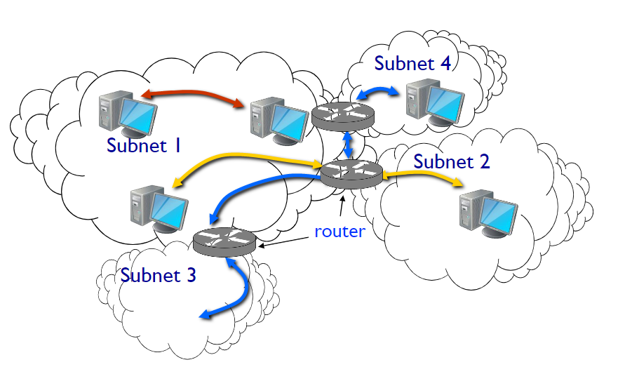
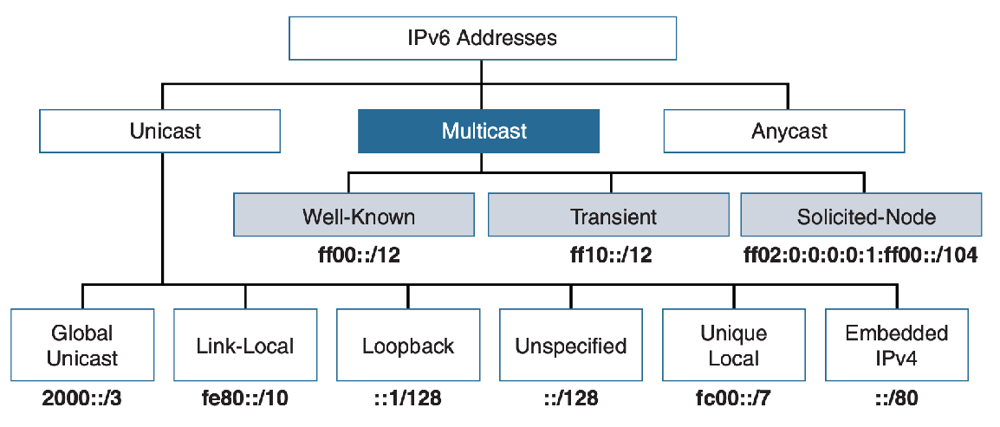

# IPv6

<!--- lezione5: 2022-10-11 -->

IPv6 nasce per soddisfare le esigenze di un maggior numero di indirizzi, superando i limiti di IPv4. La nuova versione del protocollo risulta sotto molti punti di vista superiore, anche se IPv4 è ancora in uso e non è ancora stato completamente sostituito e nel corso degli anni è stato ampiamente esteso e migliorato.

Altre motivazioni che hanno portato alla nascita di IPv6 sono:

- Più efficiente sulle LAN
- Supporto di Multicast e Anycast
- Sicurezza
- Policy routing
- Plug and Play
- Traffic Differentiation
- Mobility
- Quality of Service support

Per riuscire a definire il protocollo IPv6 ha richiesto molto tempo e siamo attualmente in una fase di migrazione (richiedendo soluzioni temporanea applicate su IPv4).

## Perché IPv4 non basta e soluzioni

Il protocollo IPv4 ha indirizzi di lunghezza 32 bit, con un totale di circa 4 miliardi di indirizzi. Nonostante ciò,, solo parte di questi indirizzi possono essere utilizzati a causa dell'utilizzo di classi, multicast, ecc. Inoltre, molti di questi sono utilizzati in modo gerarchico: il prefisso usato in una rete fisica non può essere usato in una differente. Infine, molti di questi indirizzi IP risultano non utilizzati, causando un grande spreco.

Alcune delle soluzioni utilizzate per risolvere questi problemi sono:

- Introduzione di reti "su misura" mediante l'utilizzo di netmask.
- Indirizzi privati (intranet), ma non abbastanza da risolvere il problema.
- NAT, che però rompe la connessione end to end aumentando il carico dei gateway e la relativa complessità
- ALG (Application Layer Gateway).

## Chi assegna indirizzi IP

Gli indirizzi IP vengono assegnati da parte dell'organizzazione IANA, che assegna a ciascun Regional Internet Registry (RIR) un blocco di `/8` indirizzi ip:

- AFRINIC: Africa
- APNIC: East Asia, Australia and Oceania
- ARIN: USA, Canada and some Caribbean islands
- LACNIC: South America, Mexico and some Caribbean islands
- RIPE NCC: Europe, Middle East and Central Asia

Successivamente, le RIR dividono i blocchi in blocchetti di dimensione minore da assegnare alle National Internet Registries (NIR) e alle Local Internet Registries (LIR).

## Address pool status e scalabilità

Ogni singolo indirizzo IPv4 può essere in uno dei seguenti stati:

- part of the IANA unallocated address pool,
- part of the unassigned pool held by an RIR,
- assigned to an end user entity but unadvertised by BGP, or
- assigned and advertised in BGP

Ciò comporta dei problemi anche in termini di scalabilità, dovuti:

- dimensione delle routing table (ogni subnet network deve essere advertised)
- Risorse dei router limitate (troppe informazioni da gestire)
- Limitazioni dei protocolli di routing (spesso i router cambiano)
- Perlopiù riguarda i router backbone

Sono state tentate alcune soluzioni, come:

- aggregazione di router
- CIDR (Classless Inter-Domain Routing)
- Limitazione di assegnamento di prefissi IP "non razionali" e indirizzi IP (es vendita di `/8`)

Ma nonostante ciò il problema persiste, in particolare la scalabilità dei protocolli di routing risulta attualmente non risolvibile.

## Indirizzi IPv6

E' stato scelto, attraverso un approccio di tipo scientifico e con un focus sull'efficienza, l'utilizzo di indirizzi di lunghezza pari a **128 bit**, con un totale di $2^128$ indirizzi.

La notazione non è più puntata, ma bensì si è deciso di dividere in gruppi di 2 byte (4 cifre esadecimali) separati dal carattere `:`. E' possibile utilizzare due regole per rendere più compatto l'indirizzo:

- è possibile rimuovere cifre pari a `0`. Esempio: `1080:0:0:0:7:200:A00C:3423:A089`.
- e' possibile omettere un gruppo di soli zeri inserendo `1080::7:200:A00C:3423:A089`, ma è lectio **solo una volta**. Questo perché non saprei quanti zeri inserire ciascuna volta.

## Routing

Il routing IPv6 è stato pensato in modo da non modificare la struttura adoperata in IPv4, a eccezione della lunghezza degli indirizzi.

Per dividere la parte del prefisso di rete e la parte dell'interfaccia si è deciso, per il momento, di applicare una separazione a metà con un prefisso di rete pari ad `n=64`, ma prevedendo che in futuro potremmo aver bisogno di un prefisso di rete più lungo.

Il concetto di aggregazione rimane il medesimo, è infatti possibile utilizzare il prefix length come già visto, ad esempio: `FEDC:0123:8700::100/40`. _Nota: non sarà, per quanto detto precedentemente, superiore a 64_. Non è necessario l'utilizzo di classi.

I principi di assegnamento sono i medesimi dell' IPv4, con alcune differenze in termini di terminologia:

- **Link**: physical network
- **Subnetwork**: Link!

Dividiamo le comunicazioni in:

- **On-link**: gli host hanno lo stesso prefisso, comunicano direttamente tra loro all'interno della stessa sottorete.
- **Off-link**: gli host hanno un prefisso diverso, comunicano attraverso un router.

A loro volta è possibile ulteriormente suddividere gli indirizzi di rete:

{width=450px}

## Multicast

L'equivalente dell'indirizzo multicast IPv4 ``224.0.0.0/4` è `FF00::/8`, che si suddivide in questo caso in:

- **Well-know Multicast**: `FF00::/12`, comunicazioni di servizio assegnati a gruppi di dispositivi e sono riservati. Un esempio è l'indirizzo di google.
- **Transient**: `FF10::/12`, indirizzi assegnati dinamicamente da applicativi multicast.
- **Solicited-node Multicast**: `FF02:0:0:0:0:1:FF00::/104`, simile a un indirizzo IP broadcast in ARP.

Una caratteristica importante è notare come in IPv6 scompaia l'utilizzo del broadcast, che in seguito alle evoluzioni ha dimostrato essere un rischio per la sicurezza.

L'indirizzo si scompone in:

- **8 bit** iniziali, identificano che è un indirizzo multicast.
- **4 bit** per il T flag, dice se è well known (permanente o non permanente), assegnato da IANA.
- **4 bit** per lo scopo, viene lasciato ai dispositivi.
- **112 bit** per il group ID.

{width=450px}

## Unicast

In IPv6 continuano a essere disponibili gli indirizzi unicast, con i seguenti indirizzi:

- `2000::/3` Global Unicast
- `FE80::/10`, Link-Local
- `::1/128`, Loopback (in IPv4 era `0.0.0.0`)
- `::/128`, Unspecified
- `FC00::/7`, Unique Local
- `::80`, Embedded IPv4

### Global Unicast Addresses

Sono indirizzi di tipo aggregato, che andiamo a utilizzare in modo equivalente agli indirizzi pubblico IPv4. E' globalmente raggiungibile e indirizzabile ed ha la caratteristica di essere plug and play. Attualmente sono disponibili in un range definito tra `3FFF::` e `2000::`.

{width=450px}

I prefissi per il Global Routing sono formalmente assegnati da multi-level authorities:

- 3 bit, tipologia.
- 13 bit, TLA ID (Top Level Authority, grandi ISP)
- 32 bit, NLA ID (Next-level Authority, organizzazioni)
- 16 bit, SLA ID
- 64 bit, Interface ID

{width=450px}

### Link local/site local Addresses

i link local/site local sono un gruppo di indirizzi che iniziano con `FEBF`, sono assegnati in automatico ai link quando viene acceso un router.

Gli indirizzi Link local vengono assegnati quando più router devono parlare tra di loro oppure devono annunciarsi a un router vicino.

Gli indirizzi site local, che sono ormai ritenuti deprecati perché pensati come vecchi indirizzi privati riconfigurabili, possono avere assegnati i router nelle comunicazioni (tipo stella e mesh ecc..).

### Unique Local Addresses

Gli Unique Local Addresses possono essere utilizzati in modo simile agli indirizzi globali unicast, ma sono per un utilizzo privato e non per l'indirizzamento sull'internet. Sono identificati da `FFC00::/7`, e vengono utilizzati dai dispositivi che non hanno mai necessità di connettersi all'internet e non hanno bisogno di essere raggiungibili dall'esterno.

L'ottavo bit è il _Local (L) Flag_, che divide in:

- `FC00::/8`, se L flag è 0, verrà assegnato in futuro
- `FD00::/8`, se L flag è 1, l'indirizzo è assegnato localmente

Attualmente gli indirizzi `FD00::/8` sono gli unici indirizzi validi. Sono dunque privati e non utilizzati da altri dispositivi.

{width=450px}

### IPv4 Embedded Addresses

Gli IPv4 embedded addresses sono utilizzati per rappresentare indirizzi IPv4 all'interno di un indirizzo IPv6. Vengono utilzizati per facilitare la transizione tra i due protocolli. L'indirizzo IPv4 è inserito negli ultimi 32 bit (low order) mentre i primi 80 devono necessariamente essere pari a `0`, a cui seguono 16 bit dal valore di `FFFF` (16 `1`).

{width=450px}