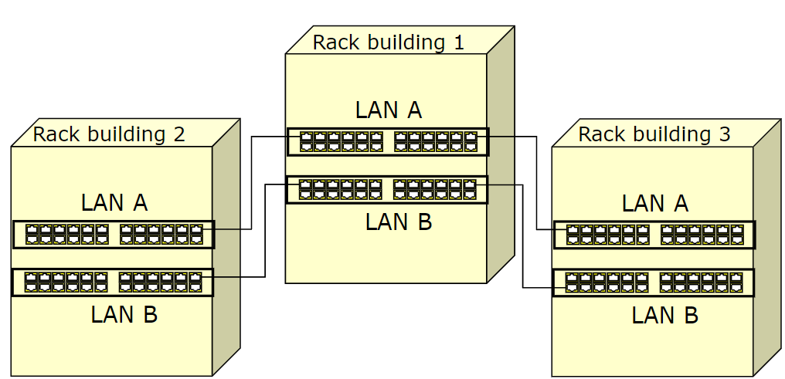
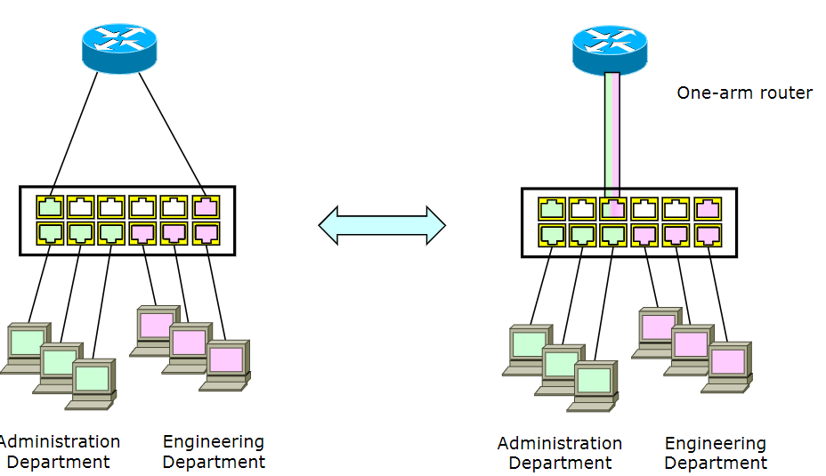

# Principi del modern Lan Design
<!-- lezione12: 27-10-2022 -->

Le wide area network appaiono negli anni 60, con la presenza di alcuni mainframes e la necessità di connettersi da remoto (ad esempio per ridurre tra più autorità i costi). Soltanto alla fine degli anni 70 compaiono le Local Area Networks in seguito alla comparsa dei primi minicomputer e i costi erano abbastanza bassi da non necessitare più dei mainframe (ancora usati ma per motivi differenti).

Inizialmente WAN e LAN si sono evolute indipendentemente in quanto erano utilizzati differenti protocolli per sopperire a necessità diverse. Soltanto in seguito si è pensato di collegare le LAN con WAN, da cui è risultato come unico vincitore IP.

Sul livello fisico ha vinto lo standard **IEEE 802**, con in particolare 802.3 ovvero **ethernet** e 802.11 ovvero il **WIFI**. Dal punto di vista cablato invece: EIA/TIA 568, ISO/IEC 11801.

In breve, i dispositivi lan si differenziano in: 

- ripetitori: hub, stesso collision domain
- bridge: switch, collision domain separato ma stesso dominio di broadcast
- router, L3 switch, separate broadcast domains

## Ripetitori

I ripetitori, dispositivi di _livello 1_, consentono di interconnettere il livello fisico ricevendo e propagando una sequenza di bit. E' utilizzato per interconnettere le reti aventi lo stesso MAC (Medium Access Control) address e ripristinare la degradazione del segnale (su lunghi cavi) consentendo la raggiunta di maggiori distanze.

Con l'avvento del cavo in rame compaiono gli HUB, ovvero una struttura a stella.  Tutti i dispositivi connessi a un hub appartengono allo stesso dominio di collisione.

## Bridge

Il bridge è un dispositivo di _livello 2_ e pertanto è in grado di comprendere una trama ethernet. Sono implementati completamente in software e composti da due porte (per questioni economiche). Interconnettono al livello di data link (da ethernet a wifi) e hanno differenti mac (medium access mechanism, framing).

Adotta una modalità store and forward, ovvero è in grado di ricevere tutta la trama, "ragionarci" e poi inoltarla verso la porta corretta che ha individuato grazie al mac e la tabella di inoltro.

Non necessariamente interconnette link layer uguali (anche se oggi per lo più è così), ma è pensato per supportarne anche di tipi differenti. Inolte riesce a gestire le collisioni ed evitarle, ottenendo una divisione del collision domain ma con un unico broadcast domain (quindi il broadcast continua a funzionare correttamente).

:::tip
**Nota**: Lo switch è un bridge a più porte
:::

{width=400px}

Bisogna però fare attenzione al fatto che sui singoli spezzoni di rete possono però esserci ancora collissioni, che vengono risolti attraverso la modalità full duplex (funzionante tra host e switch, switch e switch e host e host).

CSMA/CD non è più necessario in quanto con la modalità full duplex non sono più presenti collisioni.

## Modern LANs

Le moderne reti LAN sono basate su full-duplex, switch e ethernet. Oggi le porte ethernet possono raggiungere i gigabit e anche se ci riferiamo a switch facciamo in realtà riferimento a switch ehernet. Non è più necessario CSMA/CD (non definito per portata sopra 1GE).

:::warning
Le wireless lan funzionano in modo completamente diverso e troviamo ancora gli hub.
:::

I bridge e gli switch in ethernet prendono il nome di **transparent bridge** (anche altri non trasparenti sono stati proposti ma non più utilizzati). Il nome significa che deve essere plug & play e non dovrebbe richiedere una configurazione manuale. Inoltre, per l'utente non deve cambiare nulla e deve funzionale ugualmente (se non meglio) rispetto agli hub. I sistemi finali devono funzionare con o senza bridges. 

:::note
**Nota**: per l'utente gli switch non hanno indirizzi MAC, ma non è così.
:::

Gli switch hanno indirizzi MAC ma definizione (ogni prodotto è marchiato), ed è necessario per consentire di indirizzare il traffico e gestione dei managment frames.

Un filtering database è una tabella contenente la posizione di ciascun mac address trovato nella rete, corredato da informazioni come la destination port ed ageing time (default 300s). Lo scopo della tabella è quello di filtrare "fuori" il traffico non voluto da un link.

{width=400px}

La tabella ha componenti statiche che automatiche.

La filter table può essere popolata manualmente (poco comodo) oppure mediante appositi algoritmi con quello che si definisce backward learning, ovvero quando lo switch riceve una trama riceve anche il mac sorgente e capisce che attraverso quella porta può raggiungere quel dispositivo.

Quando uno switch non sa dove si trova un nodo (aging terminato), viene operato il flooding ma non è molto efficiente. In realtà è un falso problema perchè i nodi informarno di loro semplicemente col traffico, per cui tutti i nodi riceveranno il pacchetto e immediatamente tutti gli switch riescono ad aggiornare i propri database. Quando mi muovo non è che smetto di trasmettere il traffico! Per cui al prossimo pacchetto le informazioni verranno aggiornate.

C'è ancora un problema però se utilizzo una topologia a maglia, in particolare se mando un pacchetto broadcast: il pacchetto viene mandato a tutti e reinoltrato generando un loop che non termina se non spegnendo gli switch. Per risolvere, si usa lo spanning tree 

<!-- riguarda bene le slide intorno alla 47, le ha date per scontato -->

## Multiple LANs

Per ragioni di sicurezza o semplice preferenza, è possibile dividere una rete in più parti generando più reti distinte. Ciò comporta il dover gestire ciascun edificio con una propria rete che poi, attraverso dei cavi, connettono gli switch dei vari edifici.

{width=400px}

Questo è però indubbiamente molto costoso, per questo motivo sono state realizzate le Virtual LANs che consentono di simulare che porte specifiche di uno switch faccia parte di un dominio di broadcast differente, utilizzando una unica infrastruttura di rete. Per far parlare le virtual lan è necessario un router che ha tutte le sottoreti connesse consentendo la comunicazione come sempre, anche se la rete di origine è in realtà la medesima.

{width=400px}

Un altro modo è connettere il router a un unica interfaccia che lavora per entrambe le sottoreti, ottenendo il one arm router.

{width=400px}

Come associo un frame a una vlan? Il modo più semplice è marcare il frame quando arriva. Fino a quando la trama non è alterata, questa sarà evidenziata solo all'interno dello switch, ma non è noto a un altro switch. Per superare questo problema è stato introdotto il tagging, un campo nella trama ethernet e fornisce 4 byte aggiuntivi al frame per il vlanID che consente di identificare. 

Le configurazioni possono essere in modalità:

- **access**: invia e riceve trame non taggate, quelle che riceve le tagga localmente (??) e le invia
- **trunk**: invia e riceve trame taggate

<!-- le slide da 73 compresa in poi non fanno parte dell'esame! -->