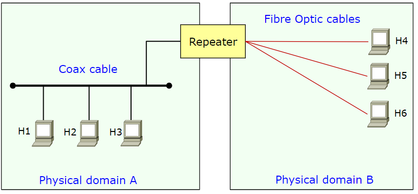
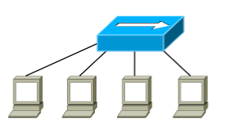
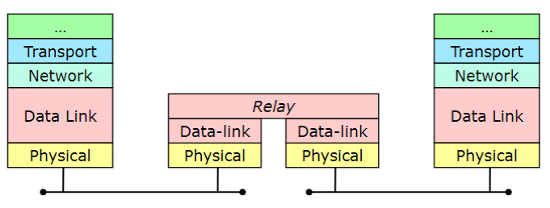
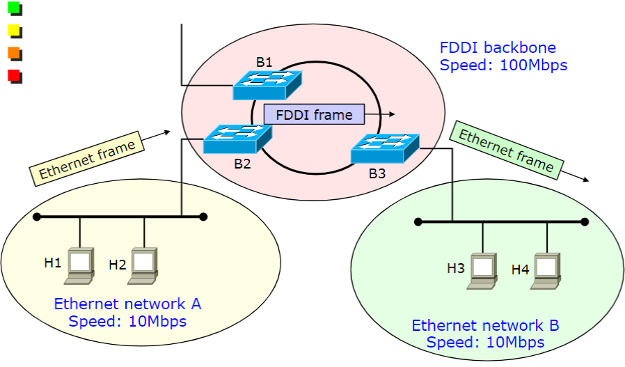
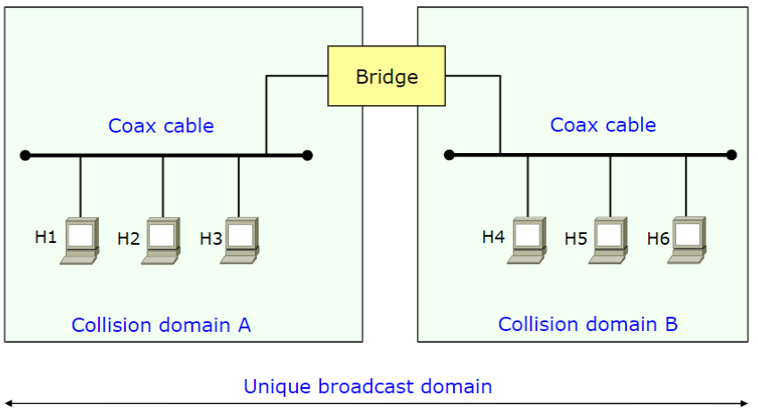
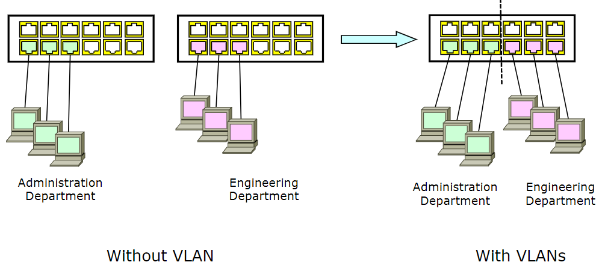
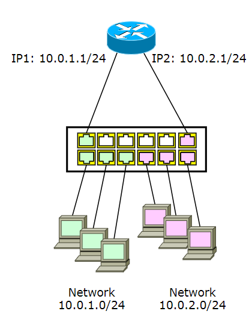
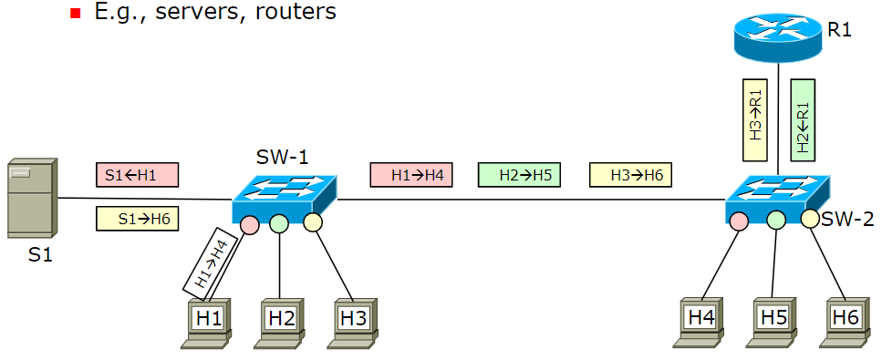
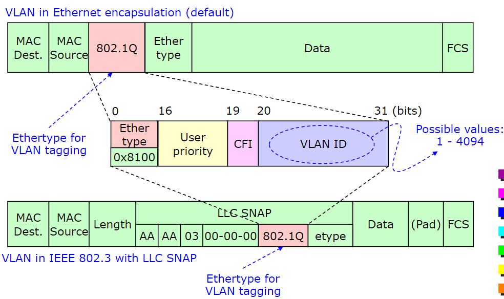
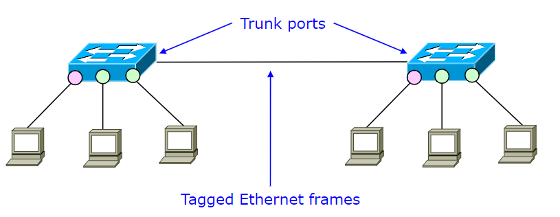

# Principi del modern Lan Design
<!-- lezione12: 27-10-2022 -->

Le **Wide Area Network** (WAN) appaiono negli anni 60, caratterizzate dalla presenza di alcuni mainframes e la necessità di connettersi da remoto (per ridurre tra più autorità i costi). Soltanto alla fine degli anni 70 compaiono le **Local Area Networks** in seguito alla comparsa dei primi minicomputer e grazie alla riduzione costi che hanno reso meno utile l'utilizzo di mainframes _(ancora usati per motivi differenti come la ricerca)_.

Inizialmente WAN e LAN si sono evolute indipendentemente in quanto erano utilizzati differenti protocolli allo scopo di sopperire a necessità diverse. Soltanto in seguito si è pensato di collegare le LAN con WAN, da cui è risultato come unico vincitore, come protocollo, IP.

Sul livello fisico ha vinto lo standard **IEEE 802**, in particolare **802.3** ovvero **ethernet** e **802.11** ovvero **WIFI**. Dal punto di vista cablato invece: EIA/TIA 568, ISO/IEC 11801.

In breve, i dispositivi lan si differenziano in:

- **ripetitori** _(livello 1)_: hub, stesso collision domain ma separato physical domains.
- **bridge** _(livello 2)_: switch, collision domain separato ma stesso broadcast domain.
- **router** _(livello 3)_: L3 switch, broadcast domains separato, non specifico per le LAN _(e non trattato in questa dispensa)_.

## Ripetitori

I **ripetitori**, dispositivi di _livello 1_, consentono di interconnettere il livello fisico ricevendo e propagando una sequenza di bit. E' utilizzato per interconnettere le reti aventi lo stesso MAC (Medium Access Control) address e ripristinare la degradazione del segnale (su lunghi cavi) consentendo la raggiunta di maggiori distanze.

Con l'avvento del cavo in rame compaiono gli HUB che utilizzano una struttura a stella.  Tutti i dispositivi connessi a un hub appartengono allo stesso dominio di collisione.

{width=300px}

{width=300px}

I ripetitore con più di due porte prendono il nome di **hub**, sono necessari per il twisted pairs e il fiber cabling.

{width=200px}

## Bridge

Il **bridge** è un dispositivo di _livello 2_ e pertanto è in grado di comprendere una trama ethernet. Sono implementati completamente in software e composti da due porte (per questioni economiche). Interconnettono al livello di data link (da ethernet a wifi) e hanno differenti MAC _(medium access mechanism, framing)_.

:::tip
**Nota**: Lo switch è un bridge a più porte.
:::

{width=350px}

Adotta una modalità store and forward, ovvero è in grado di ricevere tutta la trama, "ragionarci" e poi inoltrarla verso la porta corretta che ha individuato grazie al mac e la tabella di inoltro.

Non necessariamente interconnette link layer uguali (anche se per lo più è così), ma è pensato per supportarne anche di tipi differenti. Inoltre riesce a gestire le collisioni ed evitarle, ottenendo una **divisione del collision domain** ma mantenendo un **unico broadcast domain** (quindi il broadcast continua a funzionare correttamente).

Viene utilizzato per estendere le reti LAN (specialmente per FastEthernet), ma vi sono problemi di collisione.

Il funzionamento consiste nel ricevere e ritrasmettere (dopo) un frame, il quale viene salvato, modificato e rinviato.

{width=300px}

Il meccanismo **store and forward** permette un invio più intelligente dei dati nelle interfacce di output, riuscendo a disaccoppiare le collisioni sul dominio di broadcast (dunque il collision domain non è più un problema).

{width=300px}

Bisogna però fare attenzione al fatto che sui singoli spezzoni di rete possono ancora esserci collisioni, che vengono risolte attraverso la modalità full duplex (funzionante tra host e switch, switch e switch e host e host).

CSMA/CD non è più necessario in quanto con la modalità full duplex non sono più presenti collisioni.

{width=300px}

## Modern LANs

Le moderne reti LAN sono basate su full-duplex, switch e ethernet. Oggi le porte ethernet possono raggiungere i gigabit e anche se quando ci riferiamo a switch facciamo in realtà riferimento a switch ethernet. Non è più necessario utilizzare CSMA/CD (non definito per portate sopra 1GE).

:::caution
**Attenzione**: Le wireless LAN funzionano in modo completamente diverso (utilizzo di CSMA/CA) e troviamo ancora gli hub.
:::

### Transparent bridges

I bridge e gli switch in ethernet prendono il nome di **transparent bridge** (anche altri non trasparenti sono stati proposti ma non più utilizzati). Il nome significa che deve essere plug & play e non dovrebbe richiedere una configurazione manuale. Inoltre, per l'utente non deve cambiare nulla e deve funzionale ugualmente (se non meglio) rispetto agli hub. I dispositivi finali devono funzionare allo stesso modo con o senza bridges.

Le performance potrebbero essere differenti rispetto alla rete originale, ma le funzionalità devono essere le medesime. In particolare non devono essere presenti cambiamenti sui frame inviati dagli end systems (stesso frame, stesso MAC address, _ecc_), potrebbero esserci variazioni nel come questi vengono ricevuti ma non a livello di formato.

:::note
**Nota**: per l'utente gli switch non hanno indirizzi MAC, ma non è così.
:::

{width=400px}

Ciascuna porta di un bridge ha un MAC level e per tale motivo ha un indirizzo MAC, che non deve mai essere utilizzato per eseguire il forwarding dei data frames, bensì per consentire di indirizzare il traffico attraverso i management frames.

{width=400px}

Il forwarding del traffico è intelligente: è possibile fare forwarding attraverso una sorta di "routing table" che prende il nome di **filtering database** contenente le destinazioni in base agli indirizzi MAC. Questa deve essere disponibile localmentee e nel caso di unicast viene memorizzata solo la porta per raggiungere la destinazione (destination MAC-based forwarding) mentre nel multicast e broadcast si utilizza il flooding (tutte le porte eccetto quella da cui il frame è stato ricevuto, anche non contemporaneamente). Per far ciò è necessaria una forwarding table locale (filtering database), stazioni auto-learning (backward learning) e loop detection (spanning tree algorithm).

### Filtering database

Un **filtering database** è una tabella contenente la posizione di ciascun MAC address trovato nella rete, corredato da informazioni come la destination port ed ageing time (default 300s). Lo scopo della tabella è quello di filtrare "fuori" il traffico non voluto da un link.

{width=400px}

La tabella ha entry di due tipi:

- **statiche**: non aggiornate dal processo di learning, solitamente minori di 1000.
- **dinamiche**: popolate e aggiornate dal backward learning process. Il massimo numero di entry è pari a $ 2 / 64000 $. Vengono poi eliminate quando le stazioni non esistono più o dopo un lasso di tempo _(default 300 secondi)_.

La filter table può essere popolata manualmente (poco comodo) oppure mediante appositi algoritmi con quello che si definisce backward learning, ovvero quando lo switch riceve una trama riceve anche il mac sorgente e capisce che attraverso quella porta può raggiungere quel dispositivo.

Un esempio reale è il seguente:

```bash
Cisco-switch-1> show cam dynamic

* = Static Entry. + = Permanent Entry.
# = System Entry X = Port Security Entry

Dest MAC Address    Ports Age
------------------ ----- ---
00-00-86-1a-a6-44   1/1   1
00-00-c9-10-b3-0f   1/1   0
00-00-f8-31-1c-3b   1/2   4
00-00-f8-31-f7-a0   1/1   2
00-01-e7-00-e3-80   2/2   0
00-02-a5-84-a7-a6   2/1   1
00-02-b3-1e-b4-aa   2/1   5
00-02-b3-1e-da-da   2/5   1
00-02-b3-1e-dc-fd   2/4   2
```

Quando uno switch non sa dove si trova un nodo (aging terminato), viene operato il flooding ma non è molto efficiente. In realtà è un falso problema perchè i nodi informano di loro semplicemente col traffico, per cui tutti i nodi riceveranno il pacchetto e immediatamente tutti gli switch riescono ad aggiornare i propri database. Quando l'utente si muove non smette di trasmettere il traffico! Per tale motivo al prossimo pacchetto le informazioni verranno aggiornate.

C'è ancora un problema però se si utilizza una topologia a maglia, in particolare se mando un pacchetto broadcast, si verifica il **broadcast storm**: il pacchetto viene mandato a tutti e reinoltrato generando un loop che non termina se non spegnendo gli switch. Per risolvere, si usa lo spanning tree protocol che realizza un albero logico su una tipologia magliata fisica.

<!-- riguarda bene le slide intorno alla 47, le ha date per scontato -->

## Multiple LANs

Per ragioni di sicurezza o semplice preferenza, è possibile dividere una rete in più parti generando reti distinte. Ciò comporta il dover gestire ciascun edificio con una propria rete che poi, attraverso dei cavi, connettono gli switch dei vari edifici.

{width=350px}

Questo è però indubbiamente molto costoso, per questo motivo sono state realizzate le **Virtual LANs** (VLAN) che consentono di simulare che un set di porte specifiche di uno switch facciano parte di un dominio di broadcast differente, utilizzando un unica infrastruttura di rete. Per far parlare le VLANs è necessario un router con tutte le sottoreti connesse, permettendo la comunicazione in modo tradizionale anche se la rete di origine è in realtà la medesima.

:::danger
**Attenzione**: il traffico di livello 2 non può attraversare le VLANs.
:::

{width=400px}

{width=400px}

Un altro modo è connettere il router a un unica interfaccia che lavora per entrambe le sottoreti, ottenendo il **one arm router**.

{width=400px}

Per connettere più VLAN è necessario un router (device del livello 3) per eseguire il lookup, l'header di livello 2 viene buttato in favore di uno nuovo creato con un differente MAC address.

Il broadcast non può attraversare VLAN differenti, in quanto non è possibile utilizzare ARP per individuare i MAC address di un'altra VLAN. Gli host di Virtual LANs differenti devono fare riferimento a reti IP differenti.

{width=400px}

Il modo più semplice per associare un frame a una VLAN è marcarlo all'arrivo in base alla porta attraversata. Se però non si altera la trama, l'informazione sarà evidenziata solo all'interno dello switch che ha attraversato ma non agli altri switch. Per superare questo problema è stato introdotto il **tagging**, ovvero si utilizza un campo della trama ethernet con 4 byte aggiuntivi al frame per il vlanID, consentendoci di identificarlo anche negli switch rimanenti.

{width=300px}

{width=300px}

{width=300px}

Per apportare le modifiche citate sopra è necessario apportare delle piccole modifiche ai mac già esistenti, in particolare un nuovo framing (per il tagging) indipendente dal MAC e la lunghezza massima dei frame deve essere estesa di 4 byte.

Le porte si dividono in:

- **access**: invia e riceve trame non taggate (default su host, switches, servers, routers _ecc_), vengono solitamente utilizzato per connettere end-stations alla rete. La tipologia di frame non deve essere cambiata dal host (che non sa dell'esistenza della VLAN).
- **trunk**: invia e riceve trame taggate, deve essere configurato esplicitamente. Spesso viene utilizzato nelle connessioni switch-to-switch e per connettere server/router.

{width=300px}

{width=300px}

<!-- le slide da 73 compresa in poi non fanno parte dell'esame -->