# VPN
<!-- lezione13: 15-11-2022 -->

Una **Virtual Private Network** (VPN) è un insieme di tecnologie che consente di realizzare una connettività tra due sottoreti distinte in modo che possano comunicare come se fossero un'unica rete privata. Quando un utente si connette su internet non attraversa necessariamente un unico ISP, e questo rende lo scenario molto variegato.

L'obbiettivo è far si che due sottoreti (anche in organizzazioni diverse) riescano a comunicare mantenendo le stesse politiche (di sicurezza, quality of service, affidabilità).

{width=300px}

Gli elementi chiave sono:

- **Tunnel**: Consente di incapsulare in modo sicuro il traffico in transito sulla rete condivisa (non presente in alcune soluzioni).
- **VPN gateway**: Apre e termina i tunnel, dovranno supportare uno tra i vari protocolli specifici per fare tunneling.

Il motivo per cui utilizziamo le VPN è dunque quello di non dover utilizzare cavi per la realizzazione di reti private.

Alcune funzionalità chiave garantite dalle VPN sono:

- deployment model
- provisioning model
- protocol layer

{width=400px}

Definiremo anche alcune soluzioni:

- **site to site**: vpn a livello di sottorete (gateway), connette due reti remote (virtualizzazione del cavo).
- **end to end**: sottorete a livello di host (terminali), connette due terminali remoti (virtualizzazione del cavo).
- **Access VPN / Remote VPN / Dial In**: canale sicuro tra un terminale verso un'intera sottorete (es smart working per collegarsi alla rete aziendale).

Dal punto di vista della distribuzione, si dividono in:

- **Intranet VPN**: interconette uffici remoti della stessa azienda.
- **Extranet VPN**: interconette aziende diverse, partner, clienti in modo da fornire una accesso controllato.

Nelle extranet sono presenti alcune limitazioni, in quanto è si vuole ridurre l'accesso alle risorse di rete mediante **firewall**, ottenere **Overlapping Address Spaces** mediante _Network Address Translation_ e **controllare il traffico** in modo che quello dei partner non possa compromettere il funzionamento della rete aziendale.

:::note
Quello che contraddistingue i due tipi di rete sono perlopiù motivi di sicurezza.
:::

:::caution
**Quindi tutto il traffico sulle reti VPN è sicuro?** No, sono necessari degli ulteriori protocolli appositi (e nelle connessione s2s bisogna "fidarsi" che la rete locale sia affidabile).
:::

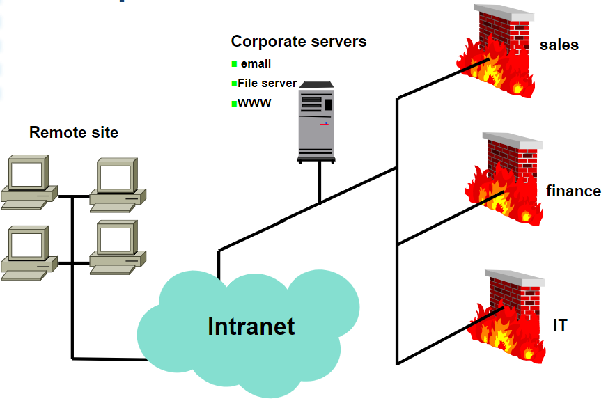{width=300px}

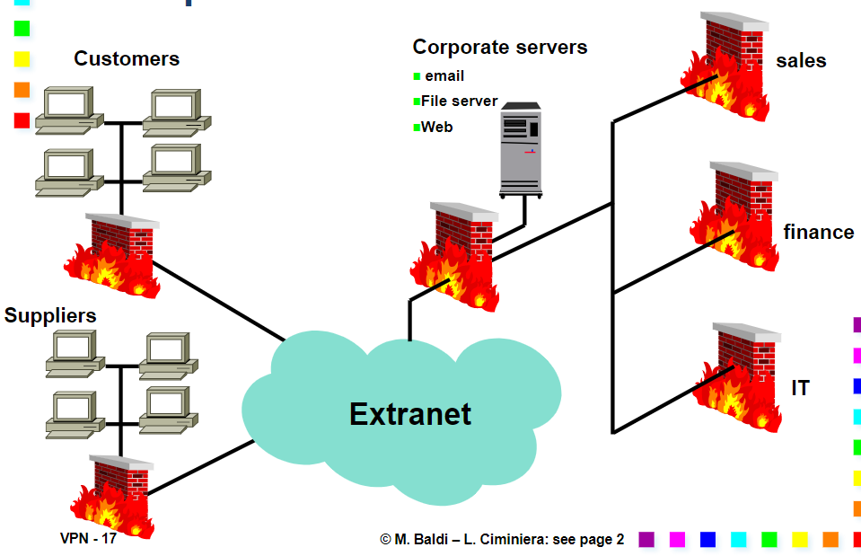{width=300px}

L'accesso a internet può essere:

- **Centralizzato**: gli utenti remoti utilizzano una rete IP pubblica per connettersi, disponibile solo negli headquarters e trasmette il traffico nella sua **interezza** da e verso internet. L'accesso è centralizzato e controllato da firewall. Il vantaggio di tale modalità è un maggior controllo.
- **Distribuito** (voluntary connection): gli utenti remoti si connettono attraverso la propria rete IP e la VPN è utilizzata solo per il traffico aziendale. Il vantaggio lo si ha nei costi che risultano essere ridotti.

{width=300px}

{width=300px}

Riassumendo, le features che una VPN mette a disposizione sono:

- Separazione dei dati (tramite tunneling).
- Aumento della sicurezza (tramite cifratura).
- Prevent tempering (integrità).
- Identificazione delle sorgenti (tramite autenticazione).

Dal punto di vista della sicurezza gli obbiettivi sono:

- **End point authentication**, verificando che un dispositivo sia chi dice di essere.
- **Integrità dei dati**, assicurando che non vengano cambiati.
- **Confidenzialità dei dati**, assicurando che non possano essere letti da altri al di fuori del destinatario.

Riassumendo, le VPN consentono di ottenere:

- Separazione dei dati, mediante tunneling.
- Aumentare la sicurezza, mediante crittografia per _end point authentication_, _integrità dei dati_ (dti non modificati) e _confidenzialità dei dati_ (dati acceduti solo dal destinatario).
- Prevenire il _tempering_, ovvero la modifica dei dati.
- Identificare le sorgenti, mediante autenticazione.

## Modalità di distribuzione

### Site to Site VPN Tunneling (s2s)

I tunnel **site to site** forniscono la garanzia che le politiche di rete avvengono a livello di infrastrutture pubblica. All'interno delle due reti aziendali la comunicazione è ritenuta sicura di default, ma se l'attaccante è interno alla rete questa risulta comunque vulnerabile.

{width=400px}

### End to End VPN Tunneling (e2e)

I tunnel **End to End** forniscono maggiore sicurezza in quanto il tunnel è realizzato direttamente tra i due host. Fin dall'inizio della comunicazione il traffico mantiene le stesse politiche di rete, in quanto a complessità è molto più oneroso sia in termini di costo che di gestione.

{width=400px}

### Remote VPN Tunneling

Il **Remote VPN Tunneling** connette un endpoint con un vpn gateway. E' possibile aggregare un'intera sottorete, ma ogni dispositivo deve essere sufficientemente robusto per connettersi.

{width=400px}

### Overlay Model

Nel **Overlay Model** la rete pubblica non partecipa alla realizzazione della VPN, non sa quale siano le destinazioni e la connessione avviene attraverso VPN gateways. Ciascuno di questi deve essere in contatto con tutti gli altri generando molti tunnel mesh. Il routing è ottenuto attraverso i gateway.

La creazione dei tunnel va a influenzare anche gli aspetti di routing: perdiamo il vantaggio del routing ma costa meno ed è del tutto trasparente (anche se il pacchetto potrebbe metterci un po' di più).

:::tip
Si può pensare come una rete _parallela_ che si sovrappone a quella fornita dal _ISP_.
:::

### Peer Model

Nel **Peer Model** ciascun VPN gateway interagisce con i router pubblici, scambiando informazioni di routing che si aggiungono a quelle fornite dal service provider. Il traffico che subisce ril outing sulla rete pubblica si muove all'interno della stessa rete VPN.

In questo approccio il routing è migliorato, ma chi realizza la VPN è fortemente coinvolto alla comunicazione di rete (non più trasparente). Inoltre, i tunnel sono tra i router compromettendo in parte la sicurezza (a livello di router posso sniffare il traffico).

### Customer Provisioned VPN

Nel **Customer Provisioned VPN** il cliente implementa la soluzione VPN e possiede, configura e gestisce i dispositivi connessi adoperando del _Customer Equipment_ (CE). Il Network Provider non è a conoscenza del fatto che il traffico generato dal cliente sia VPN. Tutte le features sono implementate sui device e i CE sono i terminatori dei tunnel.

L'host deve necessariamente avere 2 indirizzi, il remote host deve terminare il tunnel e deve averlo attivo, in caso contrario può operare ugualmente ma senza VPN.

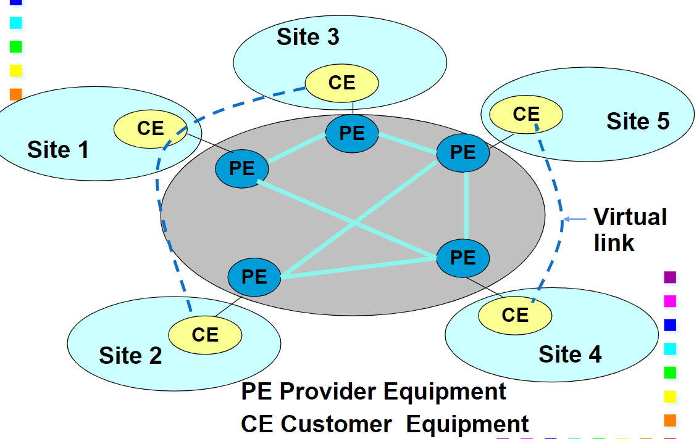{width=350px}

### Provider Provisioned VPN

Nel **Provider Provisioned VPN** il provider implementa la soluzione VPN (quindi sotto il controllo dell'azienda), e la VPN stessa è mantenuta dal provider che si occupa di gestire i dispositivi. Il _Customer Equipment_ si potrebbe comportare come se si trovasse all'interno di una rete privata, i terminatori dei tunnel sono dei Provider Equipment. E' meno costosa ma richiede la _"fiducia"_ del provider.

Il remote host deve essere sempre nella VPN, obbligando l'utente ad installare determinati dispositivi. In questo modo si ha un solo indirizzo in quanto si è sempre all'interno della VPN, necessitando di un accesso a uno specifico _Internet Service Provider_.
<!-- l'accesso non dovrebbe essere centralizzato -->

{width=400px}

### Access VPN Customer Provisioned

E' necessario considerare anche gli aspetti inerenti al piano di indirizzamento. Sui terminatori della VPN è necessario avere un indirizzo pubblico, costringendo ad avere due indirizzi. Tipicamente le remote access sono più semplici a livello di Customer Provisioner.

{width=400px}

### Tunneling
<!-- Lezione14: 16-11-2022 -->

Un pacchetto (o frame) viene inviato attraverso una rete pubblica tra due siti privati mediante nodi pubblici.

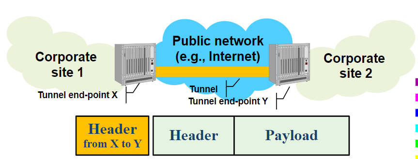{width=400px}

## Topologie

Le VPN si differenziano in due topologie (virtuali):

- **Hub and spoke**: Ciascun branch comunica direttamente con l'headquarter e raggruppa il data flow di molte aziende (centralizzate in mainframe o data center). Il routing è sub-ottimo e sono richiesti pochi tunnel, con però il rischio che l'hub possa diventare un bottleneck rallentando le prestazioni.
- **Mesh**: Utilizza un gran numero di tunnel, più difficile da gestire ma migliora il routing.

## Livelli

Un qualsiasi servizio di trasporto di pacchetti mediante tunneling funziona o come _Layer N Service_ oppure mediante un _Layer N Protocol_.

### Livello 2

Il livello 2 si suddivide in:

- **Virtual Private LAN service**: emula le funzionalità della _LAN_ e può essere utilizzato per connettere alcuni segmenti LAN (funziona come una lan singola attraverso la rete pubblica). La soluzione emula anche i _learning bridges_, con routing basato sul _MAC address_.
- **Virtual Private Wire Service**: emula una leased line, può trasportare qualsiasi protocollo.
- **IP-only Lan-like Service**: i _CE_ sono IP routers o IP hosts (non ethernet switches), viene utilizzato  solo IP (insieme a ICMP e ARP) per far viaggiare i dati nella VPN.

### Livello 3

Le soluzioni di livello 3 sono standard: i pacchetti sono inviati attraverso la rete pubblica con routing basato su indirizzi di livello 3, che possono essere **peer** (vpn/corporate/indirizzi cliente) oppure **overlay** (backbone addresses), mentre i CE possono essere sia ip routers che IP hosts. 

I pacchetti (o frame) sono trasportati attraverso la rete IP come pacchetti IP nelle seguenti modalità:

- un **pacchetto IP in un pacchetto IP** (IP in IP), come _GRE_ o _IPsec_.
- Un **frame layer 2 in un pacchetto IP** (IP in frame), come _L2TP_, _PPTP_ (basato su GRE).

{width=350px}

In particolare nel tunneling basato su **IP in IP**, dati due nodi A e B, dotati di indirizzo aziendale (non necessariamente pubblico), il tunneling abilita la comunicazione ma non assicura la sicurezza.

### Livello 4

Le soluzioni VPN di livello 4 provvedono solo alla sicurezza. Hanno come grande svantaggio l'utilizzo di soluzioni non standard.

#### Site to Site (s2s)

Nel **Site to Site** la VPN è costruita utilizzando connessioni TCP, sfruttato anche dai tunnel, mentre la sicurezza è garantita attraverso SSL/TSL. E' possibile avere header di livello 3 o di livello 4.

{width=350px}

#### End to End (e2e)

Nelle connessioni **End to End** il tunnel è terminato da un end system.

{width=350px}

## Generic Routing Encapsulation (GRE)

Il **Generic Routing Encapsulation** è un protocollo di livello 3 che si basa sul concetto di incapsulamento, il formato utilizzato è il seguente:

{width=400px}

Possiamo notare alcuni campi dell'header:

- **C, R, K, S**: sono dei flag che indicano la presenza o l'assenza di alcuni campi opzionali.
- **s**: _strict source routing flag_, se il destinatario non è raggiunto quando la source route list termina, il pacchetto viene eliminato.
- **Recur**: massimo numero di volte che il pacchetto può essere incapsulato (deve essere 0).
- **protocol**: id del protocollo per il payload _(non è vietato metterci ulteriori protocolli)_.
- **routing**: Sequenza di indirizzi dei router IP per ASs o per _source routing_.

:::note
**Nota**: anche se GRE è di livello 3, può incapsulare qualsiasi protocollo.
:::

### Enhanced GRE (version 1)

Esiste una **versione estesa** di **GRE** denominata **version 1** che utilizza _PPTP_ e aggiunge un _acknowledgment number_ in modo da avere la garanzia di invio dei pacchetti al end-point remoto.

{width=400px}

Alcune funzionalità avanzate:

- **Payload Length** (key, 16 bit alti): numero di bytes a esclusione dell'header GRE.
- **Call ID** (key, 16 bit bassi): session ID per il pacchetto.
- **Sequence number**: per ordinare i pacchetti ricevuti, error detection e correction.
- **Acknowledgment number**: massimo numero di pacchetti GRE ricevuti in sequenza in questa sessione (ACK cumulativo).

altri meccanismi implementati in GRE comprendono:

- **Flow control**: gestione del flusso attraverso il meccanismo di _sliding window_.
- **Out of order packets**: Scartato, perché _PPP_ consente pacchetti persi, ma non può gestire pacchetti fuori ordine.
- **Timeout values**: ricalcolato ogni volta che un pacchetto ack viene ricevuto.
- **Congestion control**: timeout non causa la ritrasmissione, è utilizzato solo per muovere la sliding window. I pacchetti verranno persi _(il loro valore dovrebbe essere aumentato rapidamente)_.

## Protocolli di livello 2

:::tip
**Nota**: Questi protocolli di livello 2 non sono domande da esame. Cosa differente nel caso GRE e IPsec.
:::

Per le **Access VPN** sono disponibili due protocolli:

- **L2TP** (Layer 2 Tunneling Protocol): inizialmente sono provider provisioner e non molto implementato sui terminali. E' indipendente dal protocollo di livello 2 sul host e la sicurezza è garantita da IPsec.
- **PPTP** (Point to Point Tunneling Protocol): customer provisioner, originariamente proposto da Microsoft, Apple... Ha una bassa encryption e autenticazione e utilizza un key management proprietario.

### L2TP

Le due componenti principali sono:

- **L2TP Access Concentrator** (LAC): accesso alla rete, NAS (Network access server). 
- **L2TP Network Server (LNS)**: corporate VPN gateway

Customer provisioned deployment mode by including LAC functionality in host

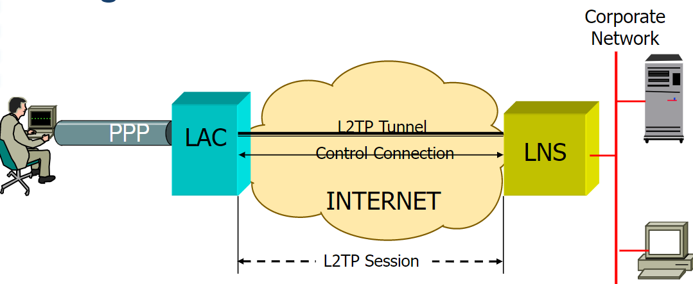{width=400px}

Più connessioni potrebbero esistere nello stesso tunnel e più tunnel potrebbero essere stabiliti per lo stesso LAC e LNS o multipli LNS.

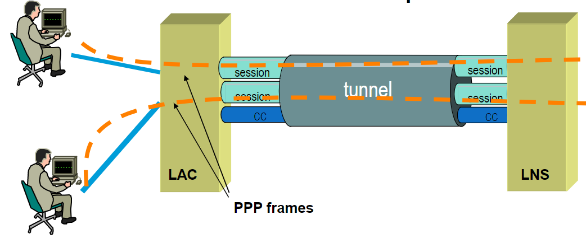{width=400px}

Le operazioni l2TP compiute sono:

1. Stabilire una control connection per un tunnel tra lac e lns
2. stabilire una o più sessioni triggered da una call request

La control connection deve essere stabilita prima che la connection request sia generata, e una sessione deve essere stabilita prima di inviare nel tunnel i frame PPP.

Quando il tunnel viene stabilito, il peer può essere autenticato. Per fare ciò si condivide uno shared secret tra LAC ed LNS. L2TP utilizza un CHAP-like mechanism: ovvero si utilizza un challenge-response protocol per autenticare il peer. Il challenge viene generato dal peer che lo invia al peer remoto, il quale risponde con la risposta. Il peer remoto può verificare la risposta e quindi autenticare il peer. Il tunnel endpoint scambia infine il local ID attribuito al tunnel.

L'header del protocollo utilizza un meccanismo particolare: 

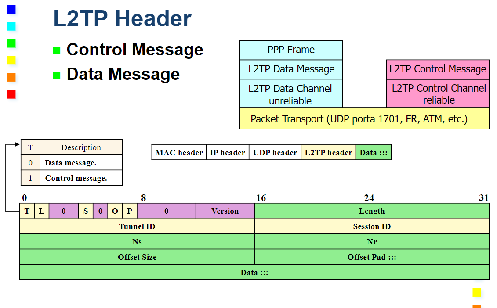{width=400px}

i campi presenti sono:

- L, S, O
- P
- Ver
- Tunnel ID
- Session ID
- Ns
- Nr
- Offset

Le connessioni dati utilizzano un sequence number per individuare i pacchetti ricevuti fuori ordine. Non è è presente la ritrasmissione di un flusso di dati e non vi è nessun ack per i data streams in quanto altri protocolli di livello 2 possono preoccuparsi di 2. I control packets invece utilizzano ack e ritrasmissione mediante selective repeat, la windows tra Tx e Rx è settata a 32k.

Dal punto di vista della sicurezza, l'autenticazione avviene solo in fase di creazione del tunnel. Un utente potrebbe fare snoop del traffico, e iniettare pacchetti nella sessione. Il tunnel e session ID dovrebbero essere selezionati in un modo non prevedibile (non sequenzialmente).

Crittografia, autenticazione e integrità devono essere assicurati da un meccanismo di trasporto (es IPsec).

### Point to Point Tunneling Protocol (PPTP)

Alcuni features:

- Adopted by IETF (RFC 2637)
- Tunneling of PPP frames over packetswitched networks
- Microsoft Encryption: MPPE
- Microsoft Authentication: MS CHAP
- PPTP Network Server (PNS)
- Corporate (VPN) gateway
- PPTP Access Concentrator (PAC)
- For provider provisioned deployment mode

Sono presenti due pacchetti, uno per la parte di controllo e una per il data tunneling.

{width=350px}

{width=350px}

## IPsec

:::danger
**Nota**: Questo è un argomento molto importante, spesso chiesto all'esame. È importante sapere cosa garantisce, a cosa serve ESP ed AH, le 3 proprietà ecc mentre è meno importante sapere dettagliatamente Transport mode, tunnel mode, come funziona.
:::

Il protocollo **IPsec** si basa sul'utilizzo di due ulteriori protocolli: **AH** e **ESP**. _AH_ è un protocollo che garantisce l'integrità dell'header originale e del payload, mentre _ESP_ garantisce integrità ed autenticazione.

AH, acronimo di _authentication header_, garantisce l'integrità dei dati, l'autenticazione del sorgente ma non la confidenzialità. L'header è inserito tra l'header IP e il payload, con protocol field pari a **51**. I router processano datagrammi (non NAT).

Alcuni campi di AH sono i seguenti:

- **SPI**: Security Parameter Index, contiene il Session ID e viene utilizzato per verificare la signature mediante crypto algorithm e un riferimento alla chiave.
- **Authentication data**: contiene la signature generata dal router di destinazione.
- **Next header**: contiene il protocollo nel payload (es TCP, UDP, ICMP, _etc_).

{width=400px}

ESP, acronimo di _Encapsulation Security Payload_, garantisce la confidenzialità dei dati, i quali sono criptati insieme al next header nel ESP trailer. Inoltre, consente l'autenticazione dell'host e l'integrità dei dati, mediante una autenticazione simile a quella di AH. Il protocol field è **50**.

{width=400px}

La differenza tra l'integrità garantita da AH ed ESP risiede nel tipo:

- AH: garantisce l'integrità dell'header originario, del payload originario e del nuovo header.
- ESP: garantisce solo l'integrità dell'header originario e del payload originario, **non** riuscendo per il nuovo header.

Un tunnel IPsec è perciò capace di garantire **incapsulazione**, **autenticazione** e **cifratura** tra due VPN gateways.

Dal punto di vista del trasporto, l'header IP non è completamente protetto ma solo autenticato se si utilizza AH.

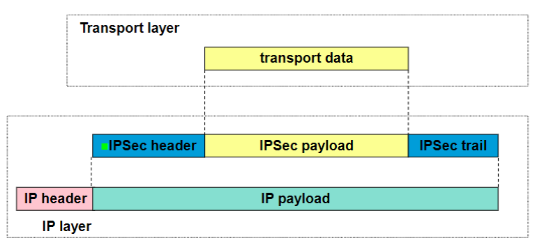{width=350px}

Le cose cambiano se la trasmissione avviene tramite tunnel, in questo caso l'header IP è completamente protetto sia nel header che nel payload mediante l'incapsulazione attraverso un ulteriore header di livello 3.

{width=350px}

<!-- salta un po' sulle slide 85, da vedere meglio -->

Le **Security Association** (SA) sono canali logici unidirezionali. Questi negoziano alcune informazioni prima di cominciare lo scambio di pacchetti IPsec. Sono identificate mediante dei Security Parameter Index (SPI ) nel header/trailer IPsec (in base alle proprietà di sicurezza richieste).

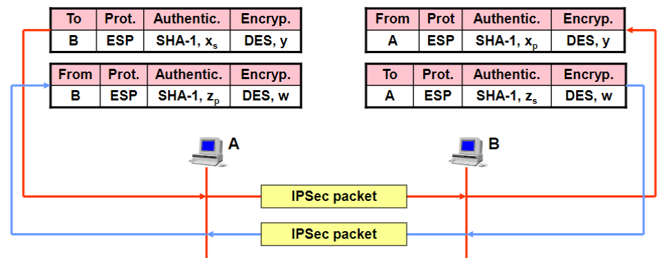{width=300px}

Il protocollo **Internet Key Exchange** (IKE) viene utilizzato per stabilire e mantenere le SA in ipsec, al fine di ottenere una comunicazione sicura per lo scambio dei messaggi IKE. Al fine di far avvenire una comunicazione sicura dei dati, vengono utilizzati uno o più SA _"figli"_. Tutte le SA figlie utilizzano la negoziazione di chiavi tramite IKE SA (potrebbero tutti partire da uno shared secret), con la possibilità di utilizzare certificati. In particolare si parla di **Internet Security Association Key Management Protocol** (ISAKMP), utilizzato per la negoziazione di parametri IKE e dello shared secret, oltre a chiavi pubbliche, certificati e dati firmati ed autenticati (e verifica della Certificate Revocation List, CRL).

:::danger
**Vi sono problemi tra l'utilizzo di IPsec e il NAT?** Si, in quanto IPsec deve garantire l'autenticazione, che non è possibile se il NAT modifica l'indirizzo IP dei pacchetti.
:::

## SSL VPN

Il protocollo SSL è il meccanismo centrale su cui si basa l'accesso sicuro. Sono:

- site to site VPN
- remote access VPN
- Secure service access (sarebbe e2e)

Spesso si perde il termine _"VPN"_ o viene aggiunto _"pseudo VPN"_, in quanto il meccanismo cambia rispetto al modello classico. Il modello di trasporto è sempre _TCP_ o _UDP_.

Uno dei principali problemi risiede nel fatto che vengono adoperate soluzioni **non standard**, per cui essendo utilizzati protocolli proprietari diventa più complicato.

Il motivo per non utilizzare IPSec VPN risiede nei costi troppo elevati e/o nelle troppe opzioni che necessitano una configurazione per garantire sicurezza. Un ulteriore motivo potrebbe essere il fatto che opera a livello kernel, per cui installazioni sbagliate possono avere conseguenze catastrofiche (oltre a installazioni difficili e rischiose).

Utilizzare **SSLVPN** ha come vantaggio:

- **Minore complessità** (installazione, configurazione, gestione)
- **Non interferisce con il kernel**
- **Molto più utilizzato**
- **Maggiore e più robusta sicurezza** (SSL)
- **Non ci sono problemi di attraversamento del NAT** o di mascheramento (non è presente l'autenticazione del header IP e non è presente la cifrature delle porte come con ESP)

Il grosso svantaggio è però che i pacchetti vengono droppati a un livello più alto, rendendolo vulnerabile ad attacchi DDOS.

Alcune insidie sulle prestazioni:

- **IP su TCP**: Nessuna consegna di pacchetti dopo uno smarrito, inoltre la perdita comporta la strozzatura del tunnel (Controllo della congestione TCP).
- **TCP su TCP**: imprevedibile, ampi buffer di trasmissione nei gateway.

Le principali problematiche sono:

- **interoperabilità**: client e server devono installare lo stesso software.
- **features specifiche** del produttore.
- Ogni implementazione potrebbe avere **bug** (perché soluzioni proprietarie).
- **Disponibilità** del client sulle specifiche piattaforme.

Per questo motivo sono definite "pseudo VPN": mentre le VPN con _IPsec_ connettono reti, host a reti, o host a host, le _SSLVPN_ connettono **utenti a servizi** o client application a server application.

:::tip
**Riassumendo**: Le SSLVPN utilizzano tunneling TCP o UDP, forniscono NAT traversal, packet filter traversal, router traversal e utilizzano client universali (web browser).
:::

Alcune soluzioni utilizzano schemi di protezione simili a protezioni vpn di livello 3.

Nelle soluzioni Pseudo VPN rientrano:

- Protocolli con SSL
- Application translation
- Port Forwarding
- Web proxying
- Application proxying

{width=300px}

### Protocolli con SSL

I protocolli che utilizzano _SSL_ sono definiti **secure application protocol**, richiedono i supporto del client e del server e hanno un funzionamento del tipo Protocol-over-SSL (POP-over-SSL, IMAP-over-SSL, SMTP-over-SSL).

{width=300px}

### Application Translation

La **Application Translation** sfrutta protocolli nativi tra il VPN server e l'application server (FTP, SMTP, POP), sfruttando un'applicazione come user interface (ad esempio web page). Il gateway spezza in comunicazione sicura e non sicura. Inoltre, è presente HTTPS tra VPN Server e Client. Non è una soluzione adatta per tutte le applicazioni.

:::tip
**Nota**: la filosofia che vi è dietro è di utilizzare in modo _"standard"_ e meno protetto il protocollo nativo, che verrà richiamato dall'esterno attraverso un'interfaccia sicura SSL.
:::

{width=300px}

### Application Proxying

L'**Application proxying** utilizza VPN gateway per scaricare le webpage attraverso http e le invia tramite https. Consente la compatibilità con server vecchi. I client puntano a un SSL-VPN gateway.

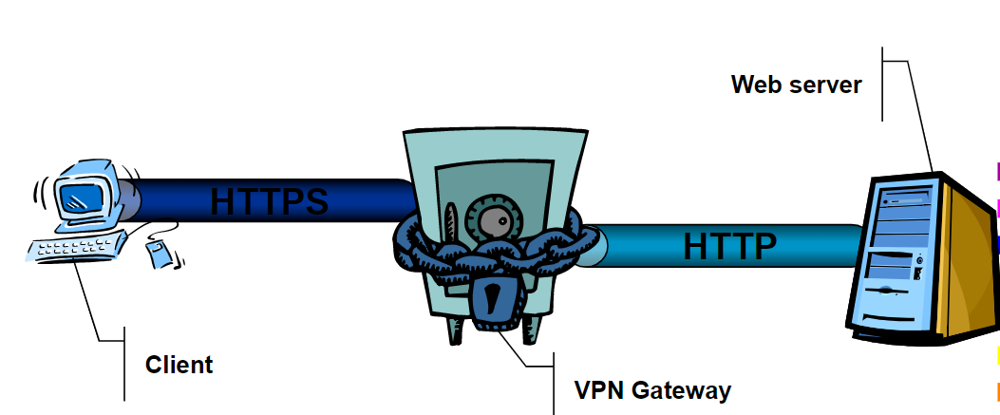{width=300px}

### Port Forwarding

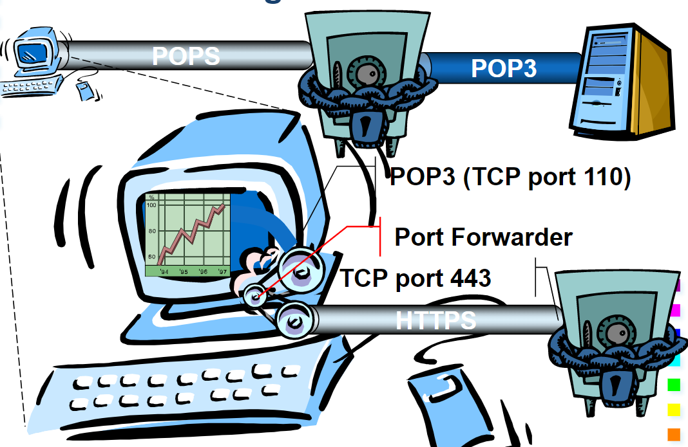{width=300px}

## VPN Gateway Positioning & anomalies
<!-- saltella di slide intorno a 101 (vero) -->

## Posizione

La posizione del VPN comporta delle problematiche differenti a seconda di dove viene posizionato (in riferimento al firewall):

- **Internamente**: nessuna ispezione del traffico VPN oppure il VPN gateway protetto da firewall.
- **Parallelamente**: potenziale accesso non controllato.
- **Esternamente**: il VPN gateway potrebbe essere protetto da un access router, Consistent policy.
- **Integrato**: Massima flessibilità.

Solitamente vengono posti degli _Intrusion Detection System_ (IDS) all'esterno del firewall senza controllo del traffico VPN e dopo il VPN gateway.

{width=350px}

## Anomalie

Le anomalie che si possono verificare nell'utilizzo delle VPN sono varie e dipendono dal contesto:

{width=400px}

### Monitorability anomaly

Si ha un **Monitorability Anomaly** quando un nodo del canale "congiunto" può vedere lo scambio dei dati.

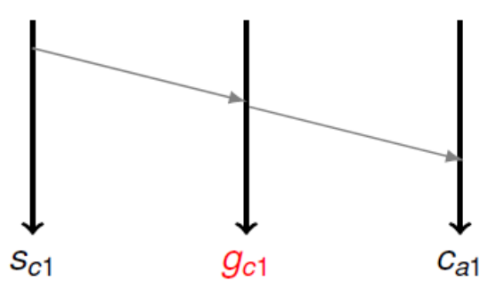{width=300px}

### Skewed Channel anomaly

Si ha uno **Skewed Channel Anomaly** quando si ha una sovrapposizione errata dei tunnel che rimuove la confidenzialità nella comunicazione. Dunque anche avendo più livelli di sicurezza, se configurati male si può avere un problema di confidenzialità e non avere nessuna sicurezza.

{width=300px}

{width=300px}
