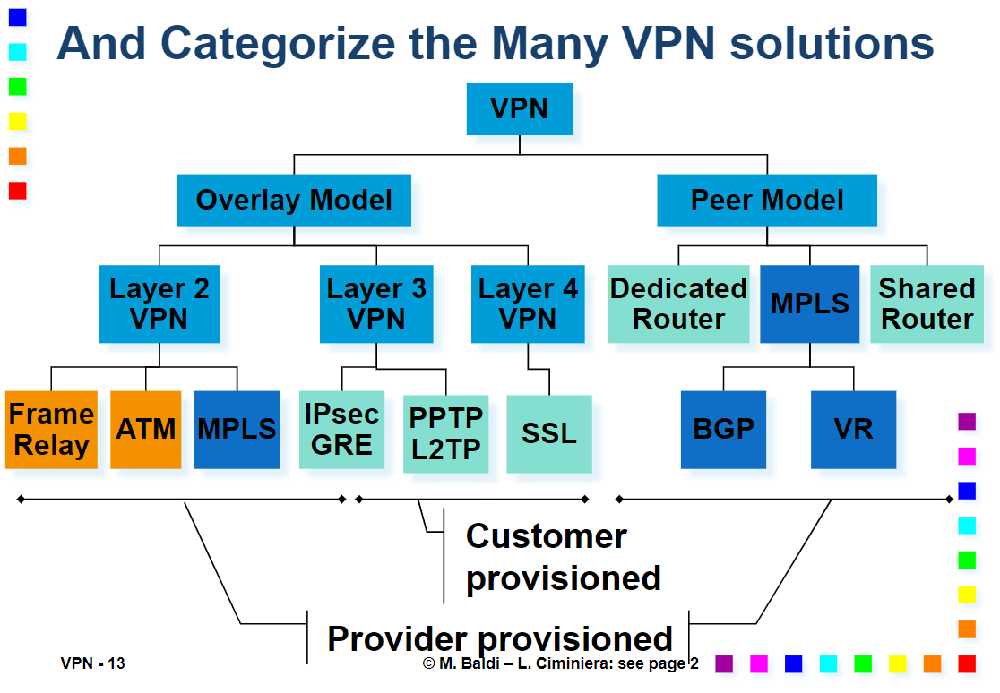
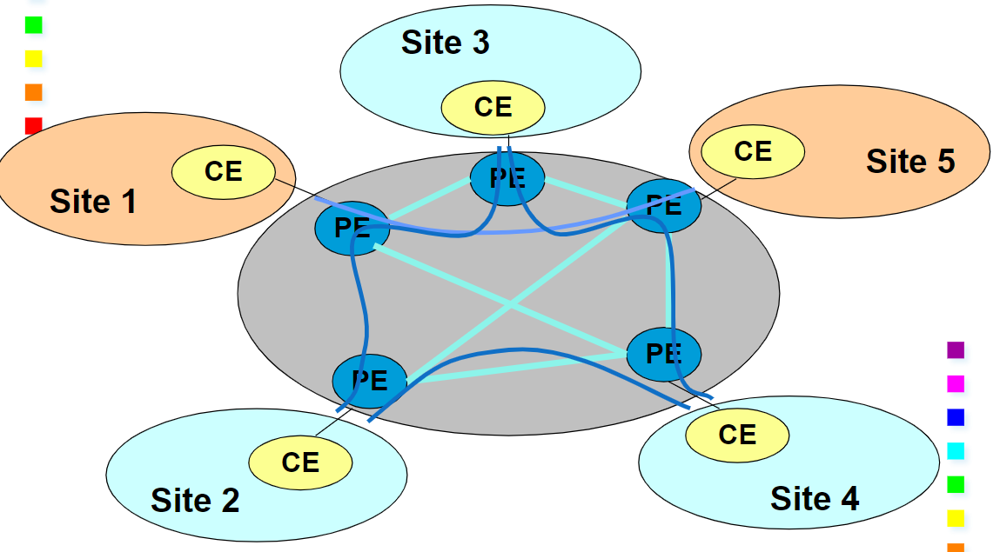
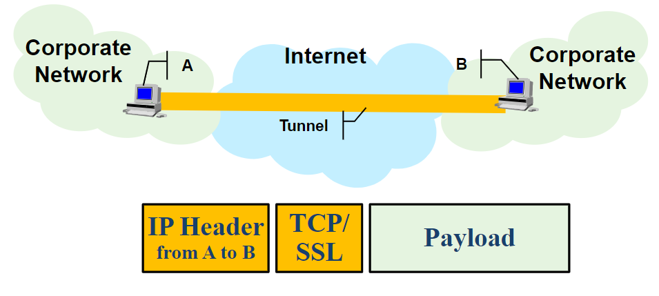
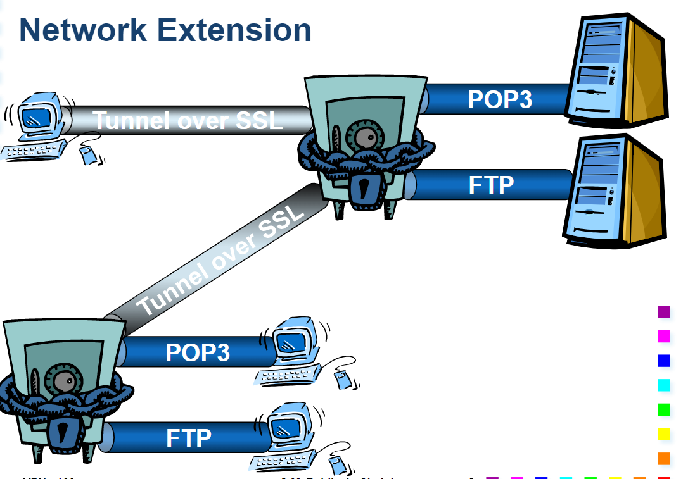
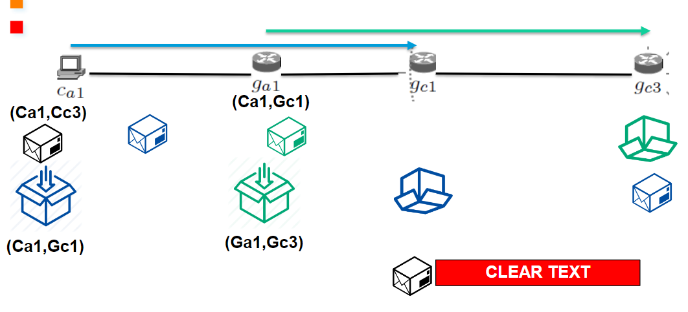

# VPN
<!-- lezione13: 15-11-2022 -->

Una VPN, Virtual Private Network, è un insieme di tecnologie che consente di realizzare una connettività tra due sottoreti distinte in modo che possano comunicare come se fossero una unica rete privata.

Quando ci connettiamo su internet non attraversiamo necessariamente un unico ISP, e questo rende lo scenario molto variegato.

L'obbiettivo è di far si che le due sottoreti (anche in organizzazioni diverse) riescano a comunicare mantenendo le stesse politiche (di sicurezza, quality of service, affidabilità).

Gli elementi chiave sono:

- **tunnel**: incapsulazione sicura di traffico in transito sulla rete condivisa (non presente in alcune soluzioni)
- **vpn gateway**: apre e termina i tunnel, dovranno supportare il protocollo specifico per fare tunneling

Il motivo per cui utilizziamo le vpn è dunque quello di non dover utilizzare cavi per la realizzazioni di reti private.

Alcune funzionalità chiave garantite dalle VPN sono:

- deployment model
- provisioning model
- protocol layer

{width=400px}

Definiremo anche alcune soluzioni:

- **site to site**: vpn a livello di sottorete (gateway)
- **end o end**: sottorete a livello di host (terminali)
- **Access VPN / Remote VPN / Dial In**: canale sicuro tra un terminale verso un'intera sottorete (es smart working per collegarsi alla rete aziendale)

Dal punto di vista del deployment:

- **Intranet VPN**: interconnettere uffici remoti della stessa azienda (due sedi di aziende diverse)
- **Extranet VPN**: interconnettere aziende diverse

A livello di extranet abbiamo interesse a ridurre l'accesso alle risorse di rete fra le reti connesse mediante firewall, Ottenere l'verlapping Address Spaces mediante network address translation e controllare il traffico in modo che il traffico dei patner non possa compromettere la rete aziendale.

:::note
Quello che contraddistingue i due tipi di rete sono perlopiù motivi di sicurezza.
:::

L'accesso a internet può essere:

- **centralizzato**: gli utenti remoti utilizzano una rete IP pubblica per connettersi, disponibile solo negli headquarters e trasmette il traffico totale da e verso internet. L'accesso è centralizzato e controllato da firewall. Il pro è un maggior controllo.
- **distribuito**: gli utenti remoti si connettono attraverso la propria rete IP e la VPN è utilizzata solo per il traffico aziendale. Il pro sono dei costi ridotti.

{width=400px}

{width=400px}

## Deployment Models

Le features che la VPN mette a disposizione sono:

- Separate Data
- Increase protection
- prevent tempering
- identify source

### Site to Site VPN

I tunnel site to site significa che la garanzia delle politiche di rete avvengono a livello di infrastrutture pubblica. All'interno delle due reti aziendali la comunicazione è ritenuta sicura di default, ma se l'attaccante sta all'interno della rete l'attacco può avvenire ugualmente.

{width=400px}

### End to End VPN

Maggiore sicurezza, si crea un tunnel diretto tra i due host. Fin dall'inizio della comunicazione il traffico mantiene le stesse politiche di rete. In termini di complessità è molto più onerosa sia in termini di costo che di gestione.

{width=400px}

### Remote VPN

Connette un endpoint con un vpn gateway. E' possibile aggregare un'intera sottorete, ma ogni dispositivo deve essere abbassata robusto per connettersi.

{width=400px}

### Overlay Model

Nel modello overlay la rete pubblica non partecipa alla realizzazione della vpn, non sa quale siano le destinazioni e la connessione avviene attraverso vpn gateways. Ciascuno deve essere in conttatto con tutti gli altri generando molti tunnel mesh e il routing è ottenuto attraverso i gateway.

La creazione dei tunnel va a influenzare anche gli aspetti di routing. Perdiamo il vantaggio del routing ma costa meno e del tutto trasparente (anche se il pacchetto potrebbe metterci un po' di più).

### Peer Model

Ciascun VPN gateway interagisce con i router pubblici, scambiando informazioni di routing e il service provider fornisce le informazioni di routing. Il traffico che subisce routing sulla rete pubblica si muove all'interno della stessa rete VPN.

In questo approccio miglioriamo il routing, ma chi realizza la vpn è fortemente coinvolto alla comunicazione di rete (e non più trasparente). Inoltre, i tunnel sono tra i router compromettendo in parte la sicurezza (a livello di router posso sniffare il traffico).

### Customer Provisioned VPN

Il cliente implementa la soluzione VPN e possiede, configura e gestisce i dispositivi connessi adoperando del customer equipment. Il network provider non è a conoscenza del fatto che il traffico generato dal cliente sia VPN. Tutte le features sono implementate sui device e i CE sono i terminatori dei tunnel.

L'host deve necessariamente avere 2 indirizzi, il remote host deve terminare il tunnel e deve attivarlo, se non è attivo può operare ugualmente senza VPN.

{width=400px}

### Provider Provisioned VPN

Il provider  implementa la soluzione VPN (quindi sotto il controllo dell'azienda), e la VPN stessa è mantenuta dal provider che si occupa di gestire i dispositivi. Il customer equipment si potrebbe comportare come se si trovasse all'interno di una rete privata, i terminatori dei tunnel sono dei Provider Equipment. E' meno costosa ma devo fidarmi del provider.

Il remote host deve essere sempre nella VPN, obbligo all'utente di installarsi determinati dispositivi. Si ha solamente un indirizzo, sono sempre all'interno della VPN e richiede l'accesso a uno specifico Internet Service Provider.

{width=400px}

### Access VPN Customer Provisioned

Bisogna considerare anche aspetti inerenti al piano di indirizzamento. Sui terminatori della vpn è necessario avere anche un indirizzo pubblico, costringendo ad avere due indirizzi. Tipicamente le remote access sono più semplici a livello di customer provisioner.

{width=400px}

### Tunneling
<!-- Lezione14: 16-11-2022 -->

Un pacchetto (o frame) viene inviato attraverso una rete pubblica tra due siti privati mediante nodi pubblici.

{width=400px}

### Topologie

Le (virtual) VPN si differenziano in due tipologie:

- Hub and spoke: Ciascun branch comunica direttamente con l'headquarter e raggruppa il data flow di molte aziende (centralizzate in mainframe o data center). Il routing è sub-optima e sono richiesti pochi tunnel, con però il rischio che l'hub possa diventare un bottleneck.
- Mesh: Utilizza un gran numero di tunnel, più difficile da gestire ma migliora il routing.

### Layers

#### Layer N

Packet transport (tunneling) provided da Layer N protocol e/o layer N service

#### Layer 2

Si suddivide in:

- Virtual Private LAN service: emula le funzionalità di Lan e può essere utilizzato per connettere alcuni segmenti LAN (funziona come una lan singola attraverso la rete pubblica). La soluzione emula anche i learning bridges, con routing basato sul mac address.
- Virtual Private Wire Service: emula uns leased line, può trasportare qualsiasi protocollo.
- IP-only Lan-like Service: i CE sono IP routers o IP hosts (non ethernet switches), viene utilizzato  solo IP (con ICMP e ARP) per far viaggiare i dati nella VPN.

#### Layer 3
Le soluzioni di livello 3 sono standard. I pacchetti sono inviati attraverso la rete pubblica con routing basato su indirizzi di livello 3, che possono essere peer (vpn/corporate/indirizzi cliente) oppure overlay (backbone addresses). I CE sono sia ip routers che IP hosts. I pacchetti ( o frame) sono trasportati attraverso la rete IP come pacchetti IP, le modalità sono due:

- un pacchetto IP in un pacchetto IP (IP in IP), come GRE o IPsec
- Un frame layer 2, in un pacchetto IP (IP in frame), come L2TP, PPTP (basato su GRE)

{width=400px}

In particolare nel tunneliing basato su IP in IP il funzionamento è il seguente: dati due nodi A e B, dotati di indirizzo aziendale (non necessariamente pubblico), il tunneling abilita la comunicazione e non assicura la sicurezza.

#### Layer 4

Le soluzioni VPN di livello 4 provvedono solo alla sicurezza, soffrono di adottare soluzioni non standard.

#### Site to Site (s2s)

La VPN è costruita utilizanndo connessioni TCP e anche i tunnel utilizzando connesioni TCP, la sicurezza è garantita attraverso SSL/TSL. E' possibile avere header di livello 3 o di livello 4.

{width=400px}

#### End to End (e2e)

Il tunnel è terminato da un end system.

{width=400px}

## GEneric Routing Encapsulation (GRE)

E' un protocollo di livello 3 che si basa sul concetto di incapsulamento, il formato utilizzato è il seguente:

{width=400px}

Possiamo notare alcuni campi dell'header:

- **C, R, K, S**: flag che indicano la p resenza o l'assenza di alcuni campi opzionali
- **s**: se vado a fare il source routing
- **recur**: Massimo numero di volte che il pacchetto può essere incapsulato (deve essere 0)
- **protocol**: id del protocollo per il payload (nessuno mi vieta di metterci ulteriori protocolli)
- **routing**: Sequenza del'indirizzo del router IP per ASs per source routing

Esiste una versione estesa di GRE denominata version 1 che utilizza PPTP e aggiunge un acknowledgment number in modo da avere garanzia di invio dei pacchetti al end-point remoto.

{width=400px}

Alcune funzionalità avanzate:

- key (16 bit alti), paylod length: numbero di bytes escludento l'header GRE
- key (16 bit bassi), Call ID: session ID per il pacchetto
- Sequence number: per ordinera i pacchetti ricevuti, error detection e correction
- Acknowledgment number: massimo numero di pacchetti GRE ricevuti in sequenza in questa sessione (comulative ACK)

altri meccanismi presenti in GRE:

- **flow control**: sliding window mechanism
- **out of order packets**: Scartato, perché PPP consente pacchetti persi, ma non può gestire pacchetti fuori ordine
- **timeout valoues**: ricalcolato ogni volta che un pacchetto ack viene ricevuto
- **congestion control**: timeout non causa la ritrasmissione, è utilizzato solo per muovere la sliding window. I pacchetti verranno persi, il loro valore dovrebbe essere aumentato rapidamente

## Layer 2 frame within an IP packet

:::tip
**Nota**: Questi protocolli di livello 2 non sono domande che poi compaiono all'esame. Cosa differente nel caso GRE e IPsec.
:::

Per le Access VPN sono disponibili due protocolli:

- L2TP (Layer 2 Tunneling Protocol): inizialmente sono provider provisioner e non molto implementato sui terminali. E' indipendente dal protocollo di livello 2 sul host e la sicurezza è garantita da IPsec.
- PPTP (Point to Point Tunneling Protocol): customer provisioner, originariamente proposto da Microsoft, Apple... Ha una bassa encryption e autenticazione e utilizza un key management proprietario.

### L2TP

Le due componenti principali sono:

- L2TP Access Concentrator (LAC): accesso alla rete, NAS (Network access server). 
- L2TP Network Server (LNS): corporate VPN gateway

Customer provisioned deployment mode by including LAC functionality in host

{width=400px}

Più connessioni potrebbero esistere nello stesso tunnel e più tunnel potrebbero essere stabiliti per lo stesso LAC e LNS o multipli LNS.

{width=400px}

Le operazioni l2TP compiute sono:

1. Stabilire una control connection per un tunnel tra lac e lns
2. stabilire una o più sessioni triggered da una call request

La control connection deve essere stabilita prima che la connectin request sia generata, e una sessione deve essere stabilita prima di inviare nel tunnel i frame PPP.

Quando il tunnel viene stabilito, il peer può essere autenticato. Per fare ciò si condivide uno shared secret tra LAC ed LNS. L2TP utilizza un CHAP-like mechanism: ovvero si utilizza un challenge-response protocol per autenticare il peer. Il challenge viene generato dal peer che lo invia al peer remoto, il quale risponde con la risposta. Il peer remoto può verificare la risposta e quindi autenticare il peer. Il tunnel endpoint scambia infine il local ID attribuito al tunnel.

L'header del protocollo utilizza un meccanismo particolare: 

{width=400px}

i campi presenti sono:

- L, S, O:
- P:
- Ver
- Tunnel ID
- Session ID
- Ns
- Nr
- Offset

Le connessioni dati utilizzano un sequence number per individuare i pacchetti ricevuti fuori ordine. Non è è presente la ritrasmissione di un flusso di dati e non vi è nessun ack per i data streams in quanto altri protocolli di livello 2 possono preoccuparsi di 2. I control packets invece utilizzano ack e ritrasmissione mediante selective repeat, la windows tra Tx e Rx è settata a 32k.

Dal punto di vista della sicurezza, l'autenticazione avviene solo in fase di creazione del tunnel. Un utente potrebbe fare snoop del traffico, e iniettare pacchetti nella sessione. Il tunnel e session ID dovrebbero essere slezionati in un modo non prevedibile (non sequenzialmente).

Crittografia, autenticazione e integrità devono essereassicurati da un meccanismo di trasporto (es IPsec).

### Point to Point Tunneling Protocol (PPTP)

Alcuni features:

- Adopted by IETF (RFC 2637)
- Tunneling of PPP frames over packetswitched networks
- Microsoft Encryption: MPPE
- Microsoft Authentication: MS CHAP
- PPTP Network Server (PNS)
- Corporate (VPN) gateway
- PPTP Access Concentrator (PAC)
- For provider provisioned deployment mode

Sono presenti due pacchetti, uno per la parte di controllo e una per il data tunneling.

{width=400px}

{width=400px}

## IPsec

:::danger
**Nota**: Questo è un argomento molto importante, che viene spesso chiesto all'esame. È importante sapere cosa garantisce, a cosa serve, ESP, AH, le 3 proprietà ecc mentre non è importante sapere dettagliatamente Transport mode, tunnel mode, come funziona.
:::

Si basa sul'utilizzo di due protocolli: AH e ESP. AH è un protocollo che garantisce l'integrita dell'header originale e del payload, mentre esp garantisce integrità ed autenticazione. 

AH, che sta per authentication header, garantisce l'integrità dei dati, l'autendicazione del sorgente ma non la confidenzialità. L'header è inserito tra l'header IP e il payload, con protocol field pari a 51. I router processano datagrammi come sempre (non NAT).

{width=400px}

La differenza tra l'integrità di AH e di ESP risiede sul tipo:

- AH: garantisce l'integrità dell'header originario e del payload originario, e anche sul nuovo header.
- ESP: garantisce solo l'header originario e al payload originario, non riuscendo per il nuovo header.

ESP garantisce la confidenzialità dei dati, data e esp trailer sono crittografati e il next header è presente nel esp trailer. Fornisce l'autenticazione dell'host e l'integrità dei dati, con una autenticazione simile a quella di AH. Il protocol field è 50.

{width=400px}

<!-- salta un p sulle slide 85, da vedere meglio -->

Le security association (SA) negozia prima di cominciare lo scambio di pacchetti IPsec. Hanno canali a logica unidirezionale e utilizzano dei Security Parameter Index (SPI ) nel header/trailer IPsec che identificano le SA. Viene specificicato quali proprietà di sicurerzza necessito.

Viene utilizzato il protocollo Internet Key Exchange (IKE) per stabilire e mantenere le SA in ipsec. Una IKE SA è stabilita perla comunicazione sicura dello scambio dei messaggi IKE. Una o più "figli" SA sono stabiliti per la comunicazione sicura dei dati. Tutti le SA figlie utilizzano la negoziazione di chiavi tramite IKE SA (potrebbero tutti partire da uno shared secret), con la possibilità di utilizzare certificati.

## SSL VPN

Utilizzano SSL per assicurare il meccanismo di sicurezza. Sono:

- site to site VPN
- remote access VPN
- Secure service access (sarebbe e2e)

Spesso si perde il termine "VPN" o viene aggiunto "pseudo VPN", in quanto le cose cambiano rispetto al modello classico.

Il modello di trasporto è sempre TCP o UDP.

Uno dei principali grossi problemi è che non sono soluzioni standard, per cui essendo utilizzati protocolli proprietari diventa più complicato.

Perchè non si dovrebbe utilizzare VPN? Perchè può essere troppo costoso per essere utilizzato in modo sicuro: troppe opzioni. Inoltre perchè opera a livello kernel, per cui installazioni sbagliate possono avere problemi catastrofici.

Utilizzare SSLVPN hanno come vantaggio:

- Minore complessità (installazione, configurazione, gestione)
- Non interferisce con il kernel
- Molto più utilizzate
- Maggiore sicurezza (SSL)
- Non ci sono problemi di attraversamento del nat o di mascheramento 

Il grosso svantaggio è però che i pacchetti vengono droppati a un livello più alto, rendendolo critico all'attacco DOS.

Le soluzioni più diffuse sono:

- **ip over tcp**:
- **tcp over tcp**:
- large trasmitter buffers in gateways

Le principali problematiche sono:

- **interoperabilità**: client e server devono installare lo stesso software.
- **features specifiche del produttore**
- ogni implementazione potrebbero avere dei bug (perchè soluzioni proprietarie)
- Disponibilità del client sulle specifiche piattaforme

Per questo motivo le chiamiamo "pseudo VPN". Le VPN ipsec connettono reti, host a reti, o host a host. Invece, le ssl vpn connettono utenti a servizi o client application a server application.

:::tip
**Riassumendo**: utilizzano tunneling TCP o UDP, forniscono NAT traversal, packet filter traversal, router traversal e utilizzano client universali (web browser)
:::

Alcune soluzioni utilizzano schemi di protezione simili a protezioni vpn di livello 3.

{width=400px}

### Application translation

Protocolli nativi tra il VPN server e l'application server. Il gateway spezza in comunicazione sicura e non sicura.

{width=400px}

### Application proxy

VPN gateway download web pages attraverso http e le invia tramite https

{width=400px}

### Port forwarding

... 

{width=400px}

## VPN Gateway Positioning & anomalies

Sono inoltre importanti gli aspetti inerenti ai firewall. Questo può essere messo:

- dentro: nessuna ispezione del traffico VPN, il gateway è protetto dal firewall
- in parallelo: potenziale accesso senza controllo
- fuori: VPN gateway protetto dal access router, policy consistente
- integrato: massima flessibilità

<!-- saltella di slide intorno a 101 (vero) -->

### Anomalies

Diversi tipi di problemi:

{width=400px}

### Monitorability anomaly

Si ha un monitorability anomaly quando un nodo del canale "congiunto" può vedere lo scambio dei dati.

{width=400px}

### Skewed Channel anomaly

Si ha uno skewed channel anomaly quando si ha una sovrapposizione errate dei tunnel che rimuove la confidenzialità nella comunicazione. Dunque anche avendo più livelli di sicurezza, se configurato male si può avere un problema di confidenzialità e non avere nessuna sicurezza.

{width=400px}

{width=400px}
