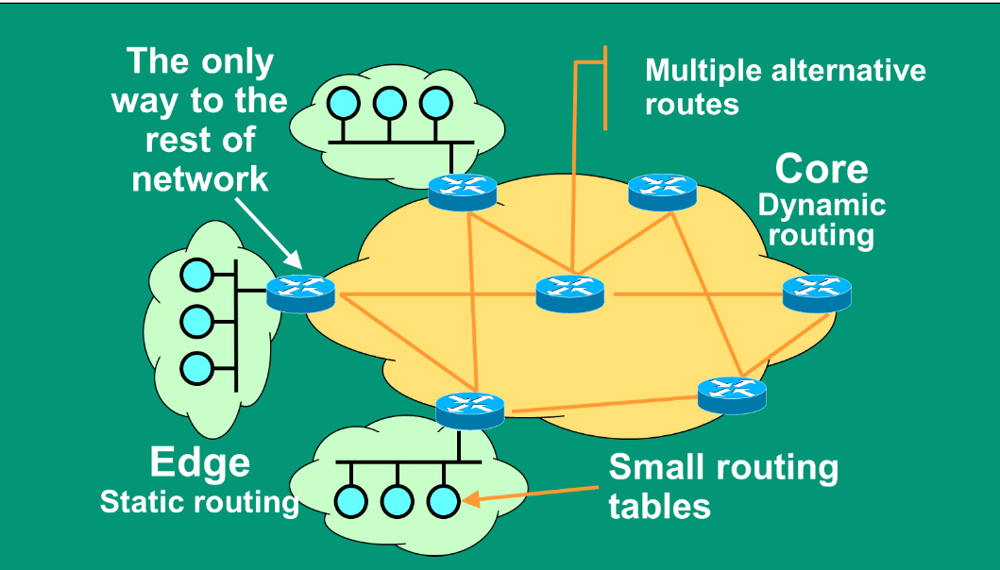
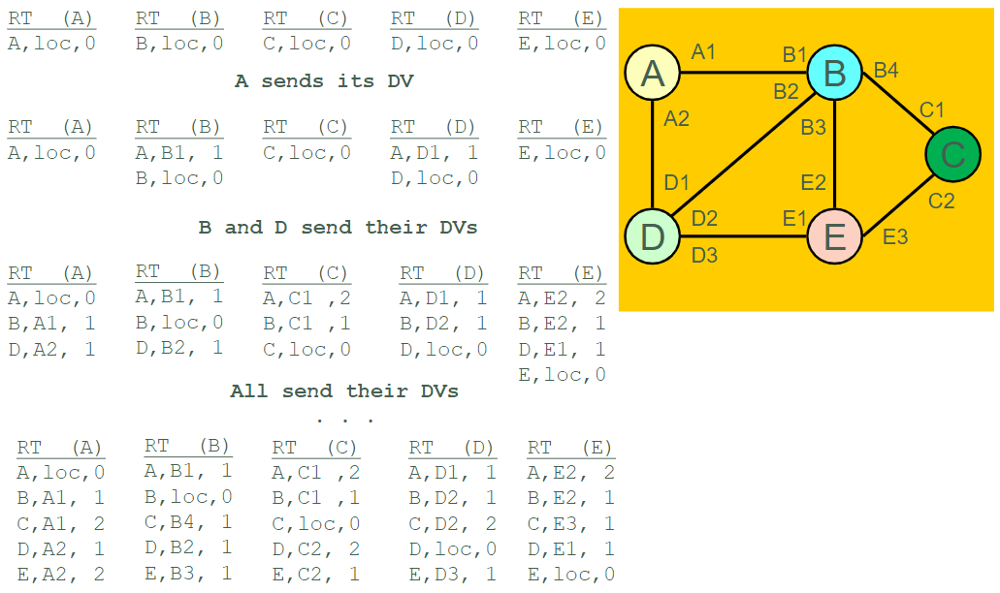
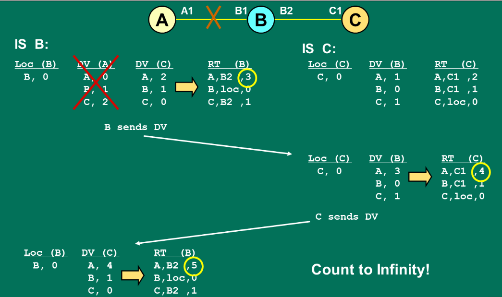
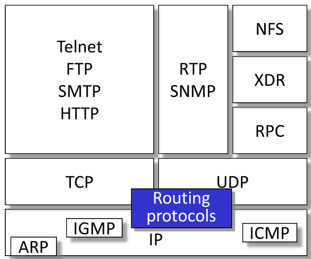
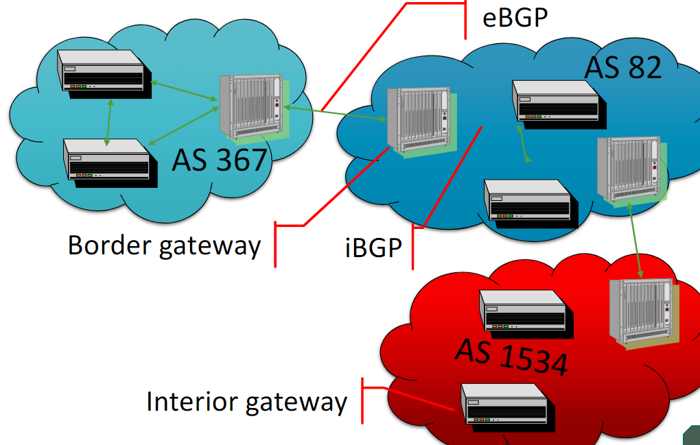
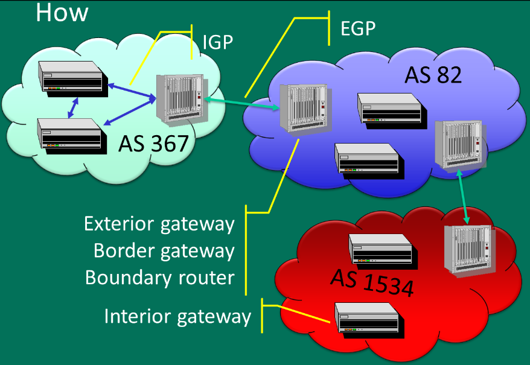

# Routing

## Introduzione

Con routing si fa riferimento al percorso che i pacchetti devono compiere nella rete, mentre il forwarding  è il processo di inviare pacchetti nella rete e include decisioni di routing. Distinguiamo il concetto di:

- routing (proactive)
- forwarding (on the fly routing)

### Proactive routing

Il proactive routing è indipendente dal traffico attuale, e in base a qualche metrica definisce quale percorso è migliore rispetto a un altro. Determina quali siano le destinazioni raggiungibili. 

:::note
**Nota**: è solitamente chiamato semplicemente _routing_.
:::

### On the fly routing

Comunemente definito forwarding, si occupa di gestire i pacchetti mediante informazioni locali come routing/forwarding table. E' il risultato del proactive routing o signaling e viene chiamato anche route.

La scelta dipende dal tipo di indirizzamento che si vuole stabilire:

- routing by network address: in base alla destinazione
- label swapping
- source routing

Si ha una operazione di switching, ovvero trasferire verso una porta di output, e di trasmissione.

## Proactive routing algorithms

Gli algoritmi di routing proactive si dividono in:

- non-adaptive alogorithms, statici
- adaptive algorithms, dinamici

### Non adaptive algorithms

I non adaptive algorithms si dividono a loro volta in Fixed Directory routing, configurato manualmente e di tipo statico, e il flooding and derivates (selective), anche questo è un tipo di approccio statico e non cambia in base alla rete.

{width=400px}

Il vantaggio è che l'amministratore ha pieno controllo della rete, ma si è più soggetti ad eventuale errore e non si adatta al cambio di topologia.

{width=400px}

### Adaptive algorithms

Gli alogoritmi dinamici si dividono in:

- centralized routing
- isolated routing
- distributed routing: distance vector e link state

Quando parliamo di **centralized routing**, si fa riferimento ad un unico nodo che si occupa di gestire la rete denominato Routing Control Center (RCC). Ha bisogno di sapere le informazioni di tutti i nodi per prendere le strategie di routing migliori e ottimizzare le performance. Inoltre, effettua il calcolo e distribuzione delle routing table. Il vantaggio è che semplifica il troubleshooting anche se è presente un carico di rete significativo in prossimità del RCC. Lo svantaggio è però il rischio che RCC diventi un bottleneck o un single point of failure, per tale motivo non è adatto per reti dinamiche di grandi dimensioni.

Nella **isolated routing** ogni nodo si comporta in modo indipendente senza alcun scambio di informazione. Non si ha dunque garanzia che il pacchetto venga effettivamente trasmesso. Uno scenario plausibile è in una rete lineare.

Nell'approccio **distributed routing** i router collaborano nello scambiare le informazioni sulla connettività. Ciascun router decide indipendentemente, ma in modo coerente. Combina i vantaggi e svantaggi rispetto ai due approcci precedenti.

## Distance vector (Bellman-Ford)

Ogni nodo invia e riceve le informazioni ai nodi vicini. E' un algoritmo distribuito e le informazioni che si scambiano è la distanza rispetto agli altri router (raggiungibili o meno). A disposizione hanno la lista dei destinatari (tutti). Sono inoltre necessari i transitori (router che non sono destinatari ma che sono necessari per raggiungere la destinazione). Visto che ogni nodo comunica con i vicini, è importante tenere conto della distanza dal announcing routing. 

DV (Distance Vector) rappresenta la distanza tra un nodo e un altro. Ad esempio:

{width=400px}

{width=400px}

Si cerca ogni volta la distanza minore per raggiungere un determinato nodo, tenendo conto dei percorsi alternativi in caso di guasto.

All'inizio ogni router ha solo le informazioni in locale, deve dunque mandare le proprie informazioni ai vicini in modo che si possa propagare nella rete la possibilità di poter raggiungere il nuovo nodo, ad esempio `a`. Il routing avviene a livello 3.

{width=400px}

I problemi che si possono riscontrare sono:

- black hole: un nodo non risponde ai messaggi di routing, quindi non si ha più informazioni sulla rete.
- count to infinity: scenario di loop, 
- balancing effect: se un nodo è più vicino ad un altro, ma il percorso è più lungo, allora il nodo più vicino non sarà scelto.

{width=400px}

{width=400px}

<!-- Lezione16: 23-11-2022 -->

Alcune soluzioni a questi problemi sono:

- **split horizon**: se `C` raggiunge A attraverso `B`, è inutile per `B` provare a raggiungere `A` tramite `C`. Previene cicli tra due nodi, velocizza la convergenza e consente di "personalizzare le DV per i vicini. Non risolve tutti i problemi quando abbiamo delle maglie chiuse (mesh)
- **path hold down**: se un link `L` fallisce, le destinazioni raggiungibili da `L` vengono considerate non raggiungibili per un certo periodo di tempo (in quarantena).
- **route poisoning**: invia una informazione volutamente scorretta al fine di scoprire prima cosa succede nella rete, alla ricerca di guasti. Quando il link fallisce il costo è incrementato, fino a quanto non si raggiunge il costo massimo (denominato infinito) si ricerca un altro percorso. Il tempo di convergenza è più rapido e può sostituire o essere complementare al path hold down e split horizon.

Più varianti sono possibili contemporaneamente, in base al protocollo che viene utilizzato.

{width=400px}

I vantaggi complessivi sono dunque la semplicità di implementazione è la semplicità di deploy per i protocolli, senza necessitare particolare configurazione.

La complessità del caso peggiore relativo al tempo di convergenza va da `O(n^2)` a `O(n^3)`, risulta inoltre limitata dai router più lenti e il set space dei router. Anche il numero di link presenti risulta essere un fattore limitante in termini di prestazioni.

## Path vector

Elimina i loop inviando, oltre le informazioni della distanza, ma anche i nodi attraversati per raggiungere una determinata destinazione. In questo modo si eevitano i loop all'interno dei transitori, ma non è molto utilizzato in quanto è un compromesso con gli svantaggi di entrambi.

## Link State Routing Algorithm

Vengono inoltrate le informazioni relative a tutte la rete, relativa allo stato di ogni nodo. Permette di creare su ogni nodo una mappa locale, inviando le informazioni attraverso un _selective flooding_.

La convergenza è rapida, inoltre i link state sono piccoli. Il traffico di rete e lo storage sono limitati, in quanto il neighbor greeting è veloce ed efficiente. Raramente genera loop ed è semplice da comprendere e "riparare", ma è più complesso da implementare, cosa che comporta protocolli con configuraizoni complesse.

Il link state viene generato quando ci sono cambiamenti topologici. Nei protocolli attuali i link state sono generati periodicamente in modo da generare un aumento di affidabilità.

### Algoritmo di Dijkstra

L'algoritmo di Dijkstra è un algoritmo per calcolare l'albero di copertura minimo di un grafo. Ha una bassa complessità pari ad $O(Llog(n))$, con $L$ numero di link ed $n£ numero di nodi. Utilizza un mecchanismo di **shortest path first**, dove il prossimo nodo è il più vicino alla sorgente e il next hop è inserito all'interno della routing table.

## Internet Routing Architecture

I protocolli di routing viaggiano tra il livello IP e il livello TCP. Un protocollo di routing è il modo con cui vado a determinare le rotte per lo scambio di informazioni attraverso una rete, basandosi su un algoritmo di routing di partenza.

{width=400px}

Per i routing protocol è necessario definire delle metriche e il loro meccanismo di encoding per il pacchetto, i parametri configuramibili e lo specifico timing.

Il dominio di routing è un insieme di router che utilizzano lo stesso protocollo di routing, che sono connessi a una porzione della rete. Un router potrebbe far parte di più routing domains (utilizzando più protocolli di routing) e può **ridistribuire** le informazioni imparate con un protocollo attraverso un altro. Questo processo è possibile attraverso una conversione delle metriche, utilizzo di filtri di advertisement e information source priority mediante una configurazione ell'amministratore.

### Autonomous System

Un autonomous System è un set di sottoreti raggruppate in base alla topologia o un criterio organizzativo (ad esempio una subnet di un grande ISP). L'indirizzamento e l'instradamento sono strettamente coordinati e l'interfaccia AS è controllata (data, informazioni di routing). Dal punto di vista amministrativo esiste è possibile indicare delle scelte di routing interno autonomo e negoziare scelte di routing esterno. E' inoltre scalabile, in quanto nessuna delle informazioni è propagata "ovunque".

E' identificato da **due byte** numerici assegnati dalla IANA (Internet Assigned Numbers Authority). Il range di numeri privati va da 64512 a 65534.

Distinguiamo i protocolli di tipo iBGP (intra Border Gateway Protocol) e eBGP (inter Border Gateway Protocol). Il primo è utilizzato per comunicare tra i router di un AS, mentre il secondo è utilizzato per comunicare tra AS diversi.

{width=400px}

E' il singolo AS che decide dove far passare i propri dati.

Il concetto di percorso più breve non è più applicabile nel caso dell'exterior routing, ma bensì il percorso _migliore_. Le scelte vengono fatte  in base a delle policies e riflette gli accordi che avvengono tra gli AS.

Le destinazioni possono essere aggregate (`195.1.2.0/24` e `195.1.3.0/24` in `192.1.2.0/23`) e si esegue un routing _gerarchico_.

**Neutral Access Point** (NAP) è un punto di accesso neutrale, che permette di collegare più AS tra loro, mentre un Internet eXchange Point (IXP) è un punto di scambio di traffico tra più AS. Sono realizzabili mediante BGP.

!Implementazione con BGP](../images/06_nap_ixp.png){width=400px}

## Protocolli di routing

I protocolli di routing distinguiamo in iBGP e eBGP.

Le feature del IGP sono:

- informazioni distribuite nella topologia
- le route sono scelte in base alle iinformazioni della topologia
- trova la migliore route

Le feature del EGP:

- Distribute Autonomous System information
- Distribute administrative costs
- Decide based on policies

### IGP

Gli algoritmi di tipo Interior Gateway Protocol li distinguiamo in **distance vector**, che comprende **RIP** (Routing Information Protocol) e **IGRP** (Interior Gateway Routing Protocol), e **link state**, che comprende OSPF e Integrated IS-IS.

Permetteva di utilizzare differenti metriche rispetto all'hop count come delay, bandwidth, reliability, load, maximum packet lenght. Inoltre, consente il **multipath routing**, ovvero la possibilità di utilizzare più percorsi per raggiungere una destinazione.

#### RIP

Primo protocollo di routing proposto, di tipo distance vector, nel 1988. Veniva supportato da macchine Unix e Linux. Come metrica utilizza come metrica Hop Count, con un tempo di convergenza di 3 minuti e un massimo di distanza di 15 hop.

#### IGRP

E' un sistema proprietario di Cisco, ch supera alcuni dei problemi di RIP, diventandone l'unica alternativa.

#### OSPF

OSPF fa parte degli algoritmi di link state e utilizza un routing di tipo gerarchico. Il routing domain è diviso in aree, in ciascuna delle quali avviene una aggregazione delle informazioni. I router sanno tutti i dettagli delle zone/domain/area, ma non sanno nulla o hanno informazioni limitate relative all'esterno. Può essere iterato.

Nello strictly hierarchical routing non si hanno informazioni sull'esterno. Quando il destinatario del pacchetto non è nella stessa area, viene forwardato attraverso un edge router. Il routing è limitato in termini di efficacia, ma è maximum scale. I path sono sub-ottimali, si ha però perdita di connettività in caso di errori.

Nel loosely hierarchical routing si ha una scalabilità minore in quanto i router devono mantenere e scambiare più informazioni, ma non è richiede strictly hierarchical addressing. Tutti gli host nel _dominio B_ non hanno bisogno di un identificatore comune, bensì si utilizzano dei prefissi. E' possibile in IPv4.

##### Architettura

Ogni area avrà una visione completa della propria topologia interna, ma verso l'esterno soltanto i collegamenti per parlare con le altre aree, avendone una visione aggregata conoscendone i router di _frontiera_.

Per $N$ router si hanno $N^2$ adiacenze e dunque link. La complessità di Dijkstra è lineare nel numero di link.

#### IS-IS

Variante del protocollo OSPF, è un estensione del protocollo OSI. Utilizza routing di tipo gerarchico con diversi livelli. E? ancora utilizzato, ma non è più diffuso nelle nuove strutture. Ha avuto utilizzo in grandi reti e ISP.

<!-- rivedi le slide intorno a 91 -->

### EGP

Gli algoritmi di tipo Exterior Gateway Protocol sono **BGP** (Border Gateway Protocol) e **IDRP** (inter DOmain Routing Protocol). Anche il routing statico è una opzione possibile. Questi non sono ne completamente distance vector ne link state.

#### BGP

Attualmente alla versione 4. Utilizza Path vector dove la destinazione è la sequenza degli Autonomous System attraversati. Ha molti attributi ed è possibile configurare la route computation policy.

Il vector exchange avviene su tcp (per maggiore affidabilità), solo a seguito di un cambiamento. Vado a creare delle sessioni tra vicini per lo scambio di informazioni attraverso una explicit configuraation of neighbors, senza necessità per la connettività diretta.

{width=400px}

#### Inter Domain Routing Protocol (IDRP)

IDRP utilizza TCP/IP e rappresenta un evoluzione di BGP  per OSI. E' supposto per essere la scelta per IPv6, ma non è molto utilizzato.