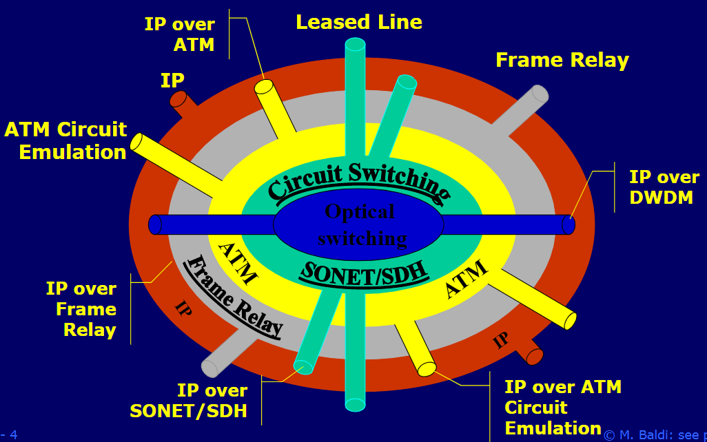
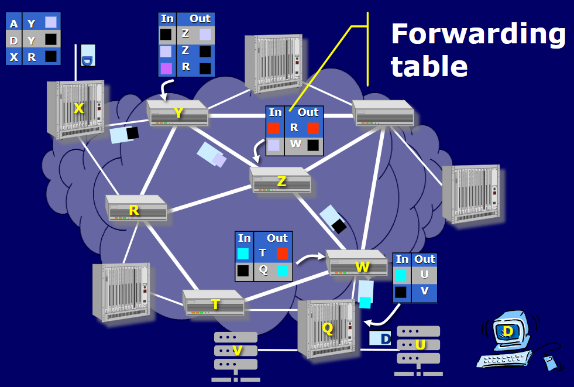
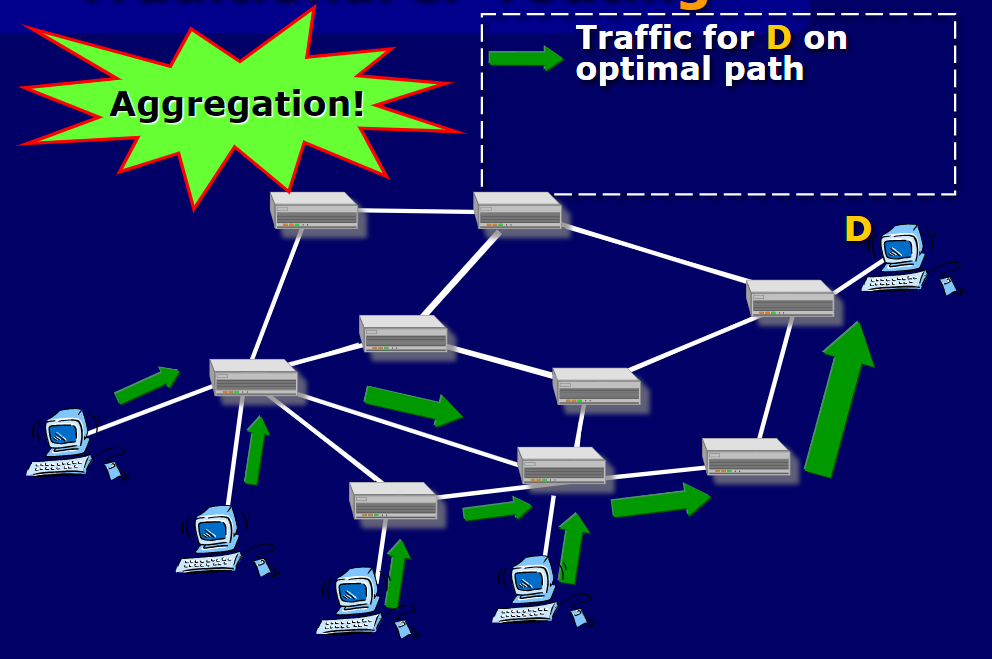

# MPLS
<!-- lezione17: 29-11-2022 -->

**MPLS** è una tecnologia importante in quanto permette la realizzazione di un nuovo tipo di rete pubblica basata su IP, dove con rete pubblica si intende una rete con traffico di diversi utenti e aziende su cui è possibile vendere dei servizi.

Una struttura utilizzata molto in passato era a _"cipolla"_, con vari strati di livelli protocollari che comunicano tra di loro per implementare varie funzionalità. Ciò comportava però una conoscenza orizzontale da parte dei tecnici su più tecnologie che dovevano comunicare tra di loro.

{width=400px}

MPLS consente di eliminare questa struttura utilizzando un solo livello protocollare, abbattendo i costi degli operatori.

{width=400px}

L'inoltro dei pacchetti avviene attraverso l'aggiunta di una **etichetta**, in base alla quale il routing effettua il forwarding invece di guardare l'indirizzo IP di destinazione. Il motivo di questo approccio risiede nella maggiore rapidità: se utilizzassimo l'indirizzo di destinazione bisognerebbe eseguire il max prefix routing cercando il prefisso più lungo nel quale l'indirizzo IP di destinazione è contenuto (tabelle molto grandi). Oggi è ancora molto utilizzata per il _traffic engineering_, ovvero distribuire il traffico della rete.

{width=400px}

Quello che fa MPLS è dunque far diventare IP _connection oriented_. Lo svantaggio di tale approccio è la necessità di creare una connessione per la comunicazione per poi eliminarla, ma aver implementato IP in modo connection-less ha però generato dei problemi più grandi.

## Architettura di rete

_MPLS_ non utilizza gli _end system_ e può essere utilizzato in una porzione di una rete, denominata **MPLS Cloud** (non ha correlazione con il cloud computing).

{width=400px}

Osservando l'immagine si può vedere:

- **LSR**: Label Switching Router.
- **Label Edge Router**: router che non ha altri router MPLS collegati.
- **LSP**: label switch path, è un percorso di comunicazione attraverso cui viaggiano i pacchetti.

{width=400px}

L'etichetta viene cambiata a ogni nodo, in modo da mantenere una etichetta più corta e poterla riutilizzare senza dover mettere d'accordo i nodi. Questa tecnica prende il nome di **label switching** e consente di ottenere scalabilità.

{width=400px}

Gli elementi chiave di MPLS sono:

- l'header MPLS, che contiene l'etichetta
- protocolli per la distribuzione delle etichette
- protocolli di routing migliorati e modificati

:::tip
**Riassumendo**: Il vantaggio è quello di utilizzare un solo protocollo per la gestione delle comunicazioni tra i nodi e anche verso l'esterno.
:::

## Storia di MPLS

A differenza di _IPv6_, **MPLS** è stato utilizzato da subito in produzione riuscendo a risolvere problemi di attori molto differenti.

Inizialmente venne implementato il _tag switching_ da parte di Cisco nei propri sistemi per sostituire il _longest path matching_.

Fino a qualche anno fa si ipotizzava che lo standard di trasmissione **ATM** _(Asynchronous Transfer Mode)_ avrebbe soppiantato internet in quanto molto superiore, ma ha come problematica il costo troppo elevato per la struttura (nessun problema di risoluzione indirizzi, signaling semplificato e un solo piano di controllo). Una prima soluzione fu quello di utilizzare ATM con IP, riutilizzando l'hardware del ATM switching. Venne successivamente introdotto MPλS (lambda!) che significava Multi-Protocol Lambda Switching).

## Header MPLS

L'header MPLS è di livello 2 ed è composta da più moduli uniti, che formano uno shim header, formati da:

- label: 20 bit
- exp: experimental bits, 3 bit
- s: bottom of stack, 1 bit, che viene messo a 1 al fondo dello stack, quando viene trovato a zero significa che sarà presente un altro modulo.
- TTL: time to live, 8 bit

Nel caso di ATM e frame relay alcune informazione sono già presenti, per cui si riutilizzano alcuni campi invece di raggiungere un nuovo modulo:

- VIC/VPI in ATM
- DLCI in frame relay

In questi casi non si guarderà il modulo MPLS ma i suddetti campi dei moduli già presenti. In questo modo il costruttore di apparati ATM non deve cambiare l'hardware ma bensì solamente il software, migliorando anche lo standard.

## LSP setup

Una **FEC**, _Forwarding Equivalence Class_, è un insieme di pacchetti che hanno lo stesso destinatario. Un LSP è un percorso di comunicazione che viene utilizzato per trasportare un FEC.

Quando viene creato un LSB, sono necessarie tre operazioni da parte dei LSR:

- label binding: associazione dell'etichetta
- label mapping: creazione della riga nella tabella di forwarding, tra ingresso e uscita
- label distribution: l'etichetta scelta deve essere comunicata ai nodi vicini (o a un nodo vicino)

### Label Binding

Un LSR determina l'etichetta che deve essere utilizzata per i pacchetti di una determinata FEC. Quello che avviene è definito Downstream binding, ovvero un LSR (??)

Il label binding può essere **unsolicited** oppure **on-demand**.

### Label Mapping

Il label mapping esegue l'associazione tra una etichetta di ingresso, scelta dal LSR considerato, e una etichetta di uscita, scelta dal downstream LSR, per riuscire a raggiungere il next hop in base al routing.

### Label Distribution

Quando un router ha fatto un binding di una etichetta, deve comunicare tale etichetta ai nodi vicini, in modo che questi possano fare il mapping (ameno al nodo di upstream). Questa operazione è detta label distribution e serve a notificare l'etichetta scelta per un dato FEC, in seguito al label binding.

### Static label binding (and mapping)

Il label binding statico avviene attraverso una gestione, ed è equivalente al PVC in ATM. Non è scalabile e non è interoparabile con tra managing systems. Inoltre, è impossibile avere LSPs tra reti differenti.

### Dynamic label binding

<!-- lezione 18: 30-11-2022 -->

Il label binding avviene in modo dinamico, in due modi possibili:

- **data/traffic driven**: triggered dai data packets
- **control driven**: ovvero innescato dai messaggi di controllo che può essere di segnalazione o di routing.

#### Control Driven 

Sono possibili due modalità:

- topology based: il router scopre che esiste una destinazione, in base alla topologia della rete, dei percorsi e delle destinazioni dunque gli lsr creano degli lsp per le destinazioni.
- explicit creation of LSPs: avviene una segnalazione esplicita, inizializzata dagli label edge routers. Avviene on demand.

### Label Distribution Protocol

La distribuzione delle etichette avviene attraverso dei protocolli, in particolare ne esistono 3 e non sono compatibili:

- **BGP**: utilizzo di un protocollo di routing, solo topology based (quando segnalo le destinazioni mando anche le etichette).
- **LDP**: label distribution protocol, realizzato appositamente. E' un evoluzione di del Tag Labelling di Cisco. Poco utilizzato perchè si aveva paura di avvantaggiare Cisco, attualmente è deprecato.
- **RSVP**: Resource Reservation Protocol, utilizzato per l'allocazione di servizi integrati all'interno delle reti.

## Protocolli di routing

Servono per determinare il percorso che farà LSP, impattando sulla fase di label mapping e determinare il packet routing.

I protocolli di routing sono in realtà quelli già esistenti:

- OSPF
- IS-IS
- BGP-4

Li utilizziamo per portare informazioni riguardo alle scelte di routing, come:

- capacità dei link
- utilizzo dei link
- dipendenze tra i link (utilizzato per il fault recovery)

## Routing modes

Le modalità di routing sono 2:

- hop by hop routing
- explicit routing

### Hop by hop routing

Ciascun LSR decide il prossimo LSR del percorso LSP. Il principio è lo stesso del IP routing tradizionale.

La procedura avviene nei seguenti step:

- viene presa una label per l'upstream link (label binding)
- la label viene mappata all'indirizzo della interfaccia del prossimo LSR del next hop
- Label announced dal next LSR

### Explicit routing

Un singolo switch sceglie il percorso per l'intera LSP. Il percorso potrebbe non essere ottimale, ma almeno evitiamo il rischio di fare percorsi circolari, realizza dunque esplicitamente il percorso LSR. Non è dunque specificato solo il FEC ma anche l'intero percorso (il nodo deve avere le informazioni su tutta la rete).

### Constraint based routing

La distribuzione delle operazioni tra nodi è impossibile, non c'è un unico criterio per scegliere il percorso e possono esserci vincoli che vanno in conflitto. Inoltre potrebbe essere difficoltoso mantenere i vincoli e le informazioni sincronizzate, in quanto variano più velocemente delle informazioni relative alla topologia.

### Label Distribution Protocol (1)

I protocolli per la distribuzione delle etichette dovrebbero essere modificcati per supportare informazioni su quale è il percorso, si parla allora di:

- **CR-LDP**: Constraint based routing label distribution protocol
- **RSVP-TE**: Resource Reservation Protocol Traffic Engineering

Questi devono essere utilizzati con OSPF-TE e IS-IS-TE.

Alcune nuove possibilità date da questo nuovo strumento sono:

- **traffic engineering**
- garantire la **qualità del servizio**
- per-class traffic engineering (sinergia con DiffServ)
- fault recovery rapido, in meno di 50 ms (50ms è importante perchè la risposta sopra tale soglia è identificata come evento catastrofico)

## Traffic Engineering

I pacchetti, quando spediti mediante ip, vengono inviati verso le destinazioni realizzando quello che è un fenomeno a imbuto e aggregazione causando una riduzione delle prestazioni.

{width=400px}

L'unica soluzione sarebbe quella di comprare nuovi router che potrebbero divenire inutile se era un problema temporaneo.

Mediante la traffic engineering possiamo distribuire il classico **non in base alla destinazione**, ma in modo omogeneo evitando la congestione.

Se si scegliesse di inviare pacchetti in modo tradizionale in accordo al carico di ogni link, ogni volta che il router ricalcola i percorsi e i nexthop sono cambiati viene aggiornata la tabella in accordo con i nuovi percorsi di rete. Questo causa un inversione di tendenza tra i carichi che iniziano a cambiare molto velocemente causando **instabilità**.

In MPLS non c'è un aggiornamento costante tra piano di controllo e piano dati, a differenza di IP, consentendo il traffic engineering. Senza MPLS l'alternativa era ATM con due control plans (i router sono ATM-unware), comportando però una ridotta scalabilità e un alto numero di adiacenze.

MPLS è IP-aware, solo un control plan operativo su una topologia fisica, rendendo il tutto più scalabile e semplice.

MPLS vede alcune estensioni come:

- MPLambdaS, ovvero MPLS control plans su rete ottica
- GMPLS, ovvero Generalized MPLS, estensione di MPLS per supportare più tipi di rete (pacchetti, circuito, optics, etc)

## CoS e QoS

Le risorse e le modalità di servizio potrebbero essere associate a un FEC nel momento di setup di un LSP. Explicit support è richiesto nel data plan e control plan di LSR (??)

### Class of Service (CoS)

La CoS è un insieme di parametri che descrivono il servizio richiesto. Consente una priorità relativa tra FEC differenti ed è in grado di fornire un garanzia assoluta.

Supporta il modello DiffServ con un comportamente per-hop, EF (expedite forwarding) e AF (assured forwarding), oltre al per class traffic engineering (ds-aware traffic engineering).

### Quality of Service (QoS)

La QoS garatisce specificatamente:

- bandwitdh
- Delay
- burst size

I vantaggi di QoS in MPLS sono vari, tra cui la possibilità di avere una rete unificata in grado di supportare tutti i tipi di servizi (marketing message).

Il supporto per QoS e i servizi real time su IP non è ancora pronto.

Molte reti multi servizio utilizzano ora un paradigma "ships in the night", dove i protocolli ATM sono per servizi tipi di ATM ed MPLS control plan è utilizzato per i servizi IP.

## Fast fault recovery

E' garantito il fast fault recovery mediante link re-routing e edge-to-edge re-routing.

0{width=300px}

{width=300px}

<<!-- slide73? -->

## Scalabilità

Le label MPLS introducono gerarchie su più livelli, a seconda di quanto richieste per la scalabilità. Le tabelle di routing dei router di transito non devono essere necessariamente complete, in quanto LSP è gestito tra gli edge routers.

In questo modo è più semplice e veloce gestire il match delle label piuttosto che il longest prefix matching.

## Penultimate Hop Popping (PHP)

Il penultimo nodo esegue il pop della label dal LSP, in modo da non doverlo fare il nodo di destinazione. Il LER indirizza il pacchetto in base all'indirizzo IP (o la prossima label nello stack).

La distribuzione di label 3 indica un implicito PHP, in qaunto l'edge router vede che il next hop è all'esterno.

Per qualsiasi router sull'ultimo hop avviene lo swap sull'etichetta 0.